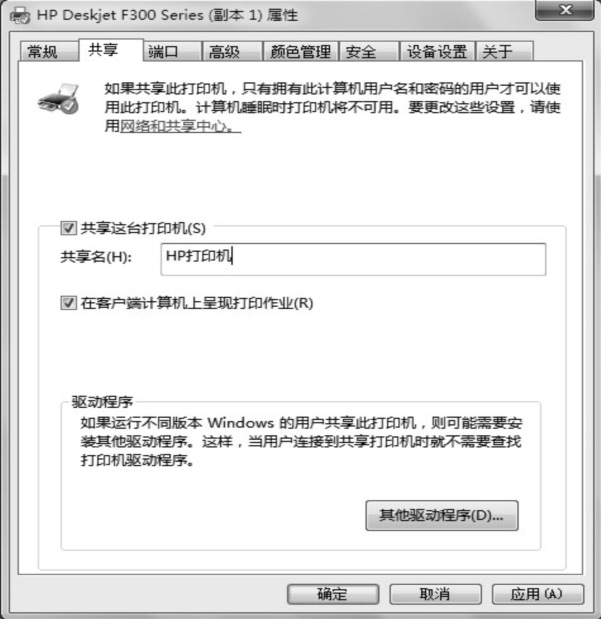
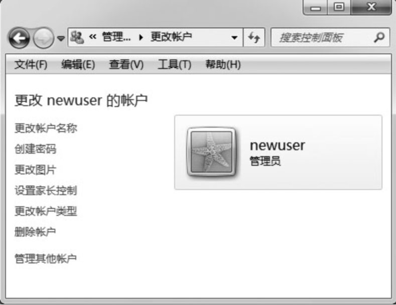

# 基本规约

### 1 字体颜色

<span style="background-color:red;border-radius:0.5em;">&nbsp;&nbsp;&nbsp;&nbsp;</span> 颜色字体标记的文字是知识点理解的关键字;

<span style="background-color:green;border-radius:0.5em;">&nbsp;&nbsp;&nbsp;&nbsp;</span> 颜色字体标记的文字是课本知识提炼内容;

<span style="background-color:orange;border-radius:0.5em;">&nbsp;&nbsp;&nbsp;&nbsp;</span> 颜色字体标记的文字是课本之外的扩展内容;

<span style="background-color:gray;border-radius:0.5em;">&nbsp;&nbsp;&nbsp;&nbsp;</span> 颜色字体标记的文字是相对不太重要的内容，考核较少;

:triangular_flag_on_post: 标记的文字是需要操作加深印象的内容，注重实践与记忆相结合;

### 1 课后作业

要求：第一遍整体学习阶段，同学需要完成课后作业，整理成自己熟悉、易记忆的文字，提高后续备考前的快速复习


# 第二章 Windows 7 操作系统

## 0 考试大纲


>        （一）了解操作系统的基本知识：操作系统的概念、功能、特征及分类，Windows 7 基本知识及基本操作，桌面及桌面操作，窗口的组成，对话框和控件的使用，剪贴板的基本操作。
>
>        （二）掌握文件及文件夹管理：文件和文件夹的概念、命名规则，“计算机”和“资源管理器”的操作，文件和文件夹的创建、移动、复制、删除及恢复（回收站操作）、重命名、查找和属性设置、快捷方式的创建、文件的压缩等，库操作。
>
>        （三）掌握  Windows 7 中控制面板的操作：设置时钟、语言和区域，声音设置，打印机设置，设备管理器的使用，程序的添加和卸载，管理用户和用户组。
>
>        （四）掌握  Windows 7 的系统维护与性能优化：磁盘的格式化、磁盘的清理、磁盘的碎片整理，磁盘的检查和备份，文件的备份和还原，使用Windows 组策略增强系统安全防护。
>
>        （五）掌握  Windows 7 中实用程序的使用：“记事本”和“写字板”、“画图”、“截图工具”、“录音机”、“计算器”、“数学输入面板”等。　

## 1. 操作系统概述

------

### 1.1 操作系统的基本功能


最早的计算机没有操作系统，人们通过各种不同的按钮控制计算机才能完成任务，并且只能由研制计算机的专家操作使用，一般用户无法使用。为了让一般用户也能使用计算机，专家们研 制出了操作系统。

操作系统(Operating System,简称OS)是直接控制和管理计算机硬件与软件资源，合理地组 织计算机工作流程的程序集合，是计算机软件系统中最主要、最基本的系统软件。现在，无论PC还是智能手机系统中都安装有操作系统，其他软件都必须在操作系统的支持下才能运行

<span style="color:green;font-weight:bold;">☆☆☆（1）操作系统控制和关系计算机软件和硬件</span>

<span style="color:green;font-weight:bold;">☆☆☆（2）是计算机软件系统中最主要、最基本的系统软件、是系统软件</span>

```B

1. （2017年判断题）操作系统是最常用的一款应用软件。
A.正确                B.错误

```

从操作计算机的角度讲，操作系统的主要功能可以简单地理解为两点，第一是对内，管理计 算机内部各种硬件和软件资源，使它们最大限度地发挥其作用。第二是对外，提供给操作人员一 个良好的操作界面，方便操作人员使用计算机。具体地说，操作系统有五个方面的功能。

#### 1. 处理机管理

操作系统能合理有效的管理和调度中央处理器，使其发挥最大的功能。在多道程序运行时，操作系统的一个主要功能就是安排好处理器的使用权，即在某个时刻处理器分配给哪个程序使用是操作系统决定的。

<span style="color:orange;border-radius:0.5em;">多道程序设计是指在主存中同时存放多道用户作业，使它们都处于执行的开始点和开始点之间，这些程序共享计算机系统资源。</span>

#### 2. 存储管理

存储管理的主要任务是管理存储器资源，为多道程序运行提供有力的支撑。存储管理的主要功能包括：存储分配、存储共享、存储保护和存储扩充。

<span style="color:green;font-weight:bold;">☆☆☆ 主要是对内存的管理</span>

#### 3. 设备管理

设备管理主要是指管理输入设备和输出设备等外部设备。操作系统的设备管理功能采用统一管理模式，自动处理内存和设备间的数据传递。

#### 4. 文件管理

文件是指存放在外存储器上的一组相关信息的集合。操作系统的文件管理功能就是负责这些文件的存储、检索、更新、保护和共享，为用户提供文件操作的方便。

#### 5. 作业管理

用户需要计算机完成某项任务时要求计算机所做工作的集合称为作业。
作业管理的主要功能是把用户的作业装入内存并投入运行，一旦作业进入内存，就称为进程。 
作业管理是操作系统的基本功能之一。

<span style="color:green;font-weight:bold;">☆☆☆ 用户作业进入内存变成了进程，用户作业可以理解为程序，程序=算法+数据结构</span>

```处理机管理

2. （2016年填空题改编）操作系统的重要功能包括___、存储器管理、设备管理、文件管理和作业管理。

```


### 1.2 操作系统的分类

------

早期，根据用户界面的使用环境和功能特征的不同，操作系统一般可分为三种基本类型:

 1）批处理系统；2）分时系统； 3）实时系统。

随着计算机科学的发展，根据使用环境不同可以分为 

1）嵌人式操作系统 ；2）个人计算机操作系统；3）网络操作系统；4）分布式操作系统。

#### 1. 批处理操作系统

批处理（Batch Processing）操作系统的工作方式是：用户将作业交给系统操作员，系统操作员将许多用户的作业组成一批作业，之后输入到计算机中，在系统中形成一个自动转接的连续的作业流，然后启动操作系统，系统自动、依次执行每个作业，最后由操作员将作业结果交给用户。 

<span style="color:green;font-weight:bold;">☆☆☆ 批处理操作系统不具有 交互性，而是为了提高CPU的利用率而提出的一种操作系统。</span>

#### 2. 分时操作系统

分时（Time Sharing）操作系统的工作方式是：一台主机连接了若干个终端，每个终端有一个用户在使用，用户交互式地向系统提出命令请求，系统接受每个用户的命令，采用时间片轮转方式处理服务请求，并通过交互方式在终端上向用户显示结果。

<span style="color:green;font-weight:bold;">☆☆☆ 采用时间片轮转</span>

#### 3. 实时操作系统

实时操作系统（Real Time Operating System）是指使计算机能及时响应外部事件的请求，在规定的严格时间内完成对该事件的处理，并控制所有实时设备和实时任务协调一致地工作的操作系统。

<span style="color:green;font-weight:bold;">☆☆☆ 并在严格的时间范围内完成对该事件的处理</span>

#### 4. 嵌入式操作系统

嵌入式操作系统（Embedded Operating System）是运行在嵌入式系统环境中，对整个嵌入式系统以及它所操作、控制的各种部件装置等资源进行统一协调、调度、指挥和控制的操作系统。 

####  5. 个人计算机操作系统

根据在同一时间使用计算机用户的多少，操作系统又可以分为单用户操作系统和多用户操作系统。

单用户操作系统是指一台计算机在同一时间只能有一个用户在使用，一个用户独自享用系统的全部硬件和软件资源，而如果在同一时间允许多个用户同时使用计算机，则称为多用户操作系统。

如果用户在同一时间内可以运行多个应用程序（每个应用程序被称作一个任务），这样的操作系统称为多任务操作系统，如果用户在同一时间内只能运行一个应用程序，对应的操作系统称为单任务操作系统。

早期的DOS操作系统是单用户单任务操作系统，Windows XP则是单用户多任务操作系统，Windows 7 则是多用户多任务操作系统。

<span style="color:green;font-weight:bold;">☆☆☆ 多个任务或者进程同时运行，叫做多任务</span>

<span style="color:green;font-weight:bold;">☆☆☆ 多个用户同时登录系统，叫做多用户</span>

<span style="color:green;font-weight:bold;">☆☆☆ Windows7 是多用户多任务的操作系统</span>

#### 6. 网络操作系统

网络操作系统是基于计算机网络的，是在各种计算机操作系统上按网络体系结构、协议和标准开发的软件，包括网络管理、通信、安全、资源共享和各种网络应用，其目标是相互通信及资源共享。

<span style="color:green;font-weight:bold;">☆☆☆ 网络操作系统是以使网络相关特性最佳为目的</span>

#### 7. 分布式操作系统 

大量的计算机通过网络联结在一起，可以获得极高的运算能力及广泛的数据共享，这种系统被称作分布式系统（Distributed System）。

<span style="color:green;font-weight:bold;">☆☆☆ 分布式操作系统是以统一、集中管理大量计算机为目的</span>


### 1.3 常用操作系统简介 

#### 1. Windows 操作系统

Windows是一个为个人电脑和服务器用户设计的操作系统。自1985年微软推出Windows 1.0以来，Windows 系统经历了近30 多年的风风雨雨。从最初运行在DOS 下的Windows 3.x，到风靡全球的Windows 9x、Windows 2000、Windows XP、Windows 2003、Windows 7、Windows 8 等，Windows 系列产品由于硬件支持良好、应用程序众多、具备出色的多媒体功能，而获得了个人电脑操作系统软件的垄断地位。

<span style="color:green;font-weight:bold;">☆☆☆ 为个人电脑和服务器用户设计的操作系统</span>

#### 2. UNIX 操作系统

UNIX 是一个强大的多用户、多任务操作系统，支持多种处理器架构，按照操作系统的分类，属于分时操作系统，最早于1969年在AT＆T的贝尔实验室开发。

<span style="color:green;font-weight:bold;">☆☆☆ AT＆T的贝尔实验室</span>

<span style="color:green;font-weight:bold;">☆☆☆  支持多任务、多处理、多用户、网络管理和网络应用，但缺乏统一标准，应用程序不够丰富， 不易学习。</span>

#### 3. Linux操作系统

Linux 是一个多用户、多任务、支持多线程和多CPU 的操作系统，它能运行主要的UNIX 工具软件、应用程序和网络协议，支持32位和64位硬件，具有开放源代码、可移植性良好、代码资源丰富以及异常的健壮特性。Linux继承了UNIX以网络为核心的设计思想，是一个性能稳定的多用户网络操作系统，主要用于基于Intel x86系列CPU的计算机。这个系统是由世界各地的成千上万的程序员设计和实现的。

<span style="color:green;font-weight:bold;">☆☆☆ 以网络为核心，性能稳定，多用户操作，支持多任务、免费开源。</span>

#### 4. IOS 操作系统

苹果IOS 是由苹果公司开发的手持设备操作系统。IOS与苹果的Mac OS 操作系统一样，属于类UNIX的商业操作系统。IOS具有简单易用的界面、令人惊叹的功能，以及超强的稳定性，原本这个系统名为 IPhone OS。

<span style="color:green;font-weight:bold;">☆☆☆ 苹果公司开发的手持设备操作系统。</span>

#### 5. Mac OS

Mac 操作系统是苹果机专用系统，是基于UNIX内核的图形化操作系统，一般情况下在普通PC上无法安装。Mac 系统由苹果公司自行开发。

<span style="color:green;font-weight:bold;">☆☆☆ Mac OS X 操作系统界面非常独特，突出了形象的图标和人机对话。</span>

<span style="color:green;font-weight:bold;">☆☆☆ 苹果公司开发的 PC 设备操作系统。</span>

#### 6. Android 操作系统

Android 是一种基于Linux的自由及开放源代码的操作系统，主要使用于移动设备，如智能手机和平板电脑，由Google公司和开放手机联盟领导及开发。

<span style="color:green;font-weight:bold;">☆☆☆ 免费开源。</span>

```B

1. （2018年单项选择题）下列不属于操作系统的是。
A. Linux B. Microsoft Office C. Windows D. Mac OS

```


## 2. Windows 7基础

------

Windows 7是微软公司于2009年10月发布的一款<span style="color:red;font-weight:bold">视窗</span>操作系统。Windows 7包含6个版本，其中Windows 7家庭高级版和Windows 7专业版是两大主力版本，前者面向家庭用户，后者针对商业用户。

### <span style="color:gray;font-weight:bold">2.1 Windows 7的基础知识 </span>

Windows 7 是微软继Windows XP、Vista之后的操作系统，它比Vista性能更高，启动更快，兼容性更强，具有许多新特性和优点，如提高了屏幕触控支持和手写识别，支持虚拟硬盘，改善多内核处理器，改善了开机速度和内核等。其主要特性有： 
    （1）更简单。Windows 7让搜索和使用信息更加简单，包括本地、网络和互联网搜索功能，直观的用户体验更加高级。
    （2）更安全。Windows 7包括改进的安全和功能合法性，还把数据保护和管理扩展到外围设备。
    （3）更好的连接。Windows 7进一步增强了移动工作能力，无论何时、何地，任何设备都能访问数据和应用程序。
    （4）更低的成本。Windows 7帮助企业优化它们的桌面基础设施，具有无缝操作系统、应用程序和数据移植功能

#### 1. Windows 7的基础知识 

如果要在电脑上运行 Windows 7，所需的基本硬件配置如下（但不仅限于此要求）：
    CPU：主频1GHz   32位或64位处理器。
    内存：1GB内存（基于32位）或2GB内存（基于64位）。
    硬盘：16GB可用硬盘空间（基于32位）或20GB可用硬盘空间（基于64位）。
    显卡：带有WDDM 1.0或更高版本驱动程序的DirectX 9图形设备。
    显示器：要求分辨率在1024×768像素及以上（低于该分辨率则无法正常显示部分功能），或可支持触摸技术的显示设备。

 Windows 7系统的软件需求只是指对硬盘系统的要求。安装Windows 7系统的硬盘分区必须采用<span style="color:red;font-weight:bold">NTFS</span>结构，要确保至少有16GB 的可用空间，最好能提供40GB可用空间的分区供系统安装使用。

#### 2. Windows 7的启动

打开主机电源后，根据用户的不同设置，可以直接登录到桌面完成启动，也可以启动登录对话框，输入用户名和密码，确认后登录。

#### 3. 关闭与重启计算机

:triangular_flag_on_post:单击任务栏的“开始”按钮，在“开始”菜单中单击“关机”按钮 ，则在计算机完成了一系列操作后，操作系统会将计算机的电源自动关闭。单击“关闭”按钮右侧箭头，在出现的菜单中选择“重新启动”命令，可以完成计算机的重新启动。

####  4. 键盘、鼠标的基本操作

Windows 7的各种操作主要通过键盘和鼠标完成。键盘上除了常用的字母、数字和符号键以外，还有一些功能键，如Ctrl、Shift、Alt 等。功能键和其他键可以组成快捷键来使用，以方便完成某些操作。如组合键Alt+Tab 可以在打开的多个程序或窗口间切换，Alt+F4 关闭当前应用程序或窗口。鼠标是操作计算机最常用的输入设备，它快捷、方便、易学。鼠标一般有两个键，分别称为左键和右键。常用的鼠标操作主要有：

​      1）移动/指向/定位：移动鼠标，使其指向操作对象。
​      2）左击：简称“单击”，即点击鼠标左键一次。
​      3）右击：点击鼠标右键一次。
​      4）双击：连续快速点击鼠标左键两次。
​      5）释放：松开鼠标按键。
​      6）拖动：按着鼠标左（右）键不放，然后拖动鼠标。


#### 5. 窗口

Windows 7 操作系统及其应用程序采用图形化界面，只要运行某个应用程序或打开某个文档，就会对应出现一个矩形区域，这个矩形区域称为窗口。虽然每个窗口的内容各不相同，但大多数窗口都具有相同的基本组成部分，如图2-1 所示。


1） 边框
 组成窗口的四条边线称为窗口的边框，拖动边框可以改变窗口的大小。

 2） 标题栏
窗口中最上边的一行是标题栏，标题栏显示已打开应用程序的图标、名称等，还有“最小化”、“最大化”和“关闭”按钮。单击左上角的应用程序图标，会打开窗口中应用程序的控制菜单，使用该菜单也可以实现最小化、最大化和关闭等功能。另外，拖动标题栏可以移动窗口，还可以双击标题栏完成窗口的最大化和还原的切换。

Windows 7是一个多任务操作系统，允许多个程序同时运行，但是在某一时刻，只能有一个窗口处于活动状态。所谓活动窗口是指该窗口可以接收用户的键盘和鼠标输入等操作，非活动窗口不会接收键盘和鼠标输入，但相应的应用程序仍在运行，称为后台运行。

 3） 地址栏
地址栏显示当前所在的位置。通过单击地址栏中不同位置，可以直接导航到这些位置。

4） 搜索栏
在搜索框中键入内容后，将立即对文件中的内容进行筛选，并显示出与所键入内容相匹配的文件。在搜索时，如果对查找目标的名称记得不太确切，或需要查找多个文件名类似的文件，则可以在要查找的文件或文件夹名中适当地插入一个或多个通配符。通配符有两个，即问号（?）和星号（*），其中问号（?）可以和一个任意字符匹配，而星号（*）可以和多个任意字符匹配。

5）“ 前进” “/ 后退”按钮
使用“前进” /“ 后退”按钮可以导航到曾经打开的其他文件夹，而无需关闭当前窗口。

6） 工具栏
工具栏中存放着常用的操作按钮。在Windows 7 中，工具栏上的按钮会根据查看的内容不同而有所变化，但一般包含“组织”和“视图”等按钮。通过“组织”按钮可以实现文件（夹）的剪切、复制、粘贴、删除、重命名等操作，通过“视图”按钮可以调整图标的显示大小与方式。

7） 导航窗格
用户可以在导航窗格中单击文件夹和保存过的搜索，以更改当前文件夹中显示的内容。使用导航窗格可以访问文档、图片和音乐等库。

8） 详细信息面板
详细信息面板显示当前路径下的文件和文件夹中的详细信息，如文件夹中的项目数、文件的修改日期、大小、创建日期等。

9） 菜单栏
窗口在默认情况下不显示传统的菜单栏及工具栏等，用户可以自行设置所需的项目。在“计算机”窗口中，单击“组织”→“布局”→“菜单栏”，可将传统的菜单栏显示出来。菜单栏一般包含“文件”、“编辑”、“查看”、“工具”、“帮助”等菜单项，每个菜单项又有许多选项，每个选项对应一个命令来实现某种操作。一般情况下，该窗口所允许的操作都会在菜单栏中找到对应的菜单命令。 

<span style="color:green;font-weight:bold;">☆☆☆菜单栏与工具栏的区别：功能上没有区别，就是使用的便捷性上有区， 一些常用功能是在工具栏上的，并且可以图形来表示出来菜单栏包含了所有的控制功能!</span>

在这些菜单中，Windows 使用了许多特殊标记，这些特殊标记都具有特定的含义。常见的标记有： 

（1）“△”标记：表明此菜单项目下还有下级菜单。
（2）“…”标记：表明单击此菜单会打开一个对话框。
（3）“ √”标记：有些菜单是复选菜单，菜单项的文字前出现符号“√”，表明正处于选中状态。再次单击该菜单项时，标记会消失，表明取消选中该菜单项。
（4）“ ●”标记：表明该菜单为单选菜单，在所列出的菜单组中，同一时刻只能有一项被选中。
另外，菜单项目中间灰色的横线称为分隔线。当一个菜单项目呈灰色时，表明此菜单项目当前不可用。

 10） 滚动条
当用户区域显示的文档的高度大于显示窗口的高度时，将在右侧出现垂直滚动条；当文档的宽度大于显示窗口的宽度时，将在底部出现水平滚动条。

```D

1.（2019年单项选择题）Windows 7操作系统中，某窗口的大小占桌面的三分之二，该窗口标 
题栏最右边存在的按钮分别是。
A.最小化、还原、关闭 B.最小化、最大化、还原
C.最大化、还原、关闭 D.最小化、最大化、关闭

```

```C

2.（2019年单项选择题）在Windows 7中，如果菜单项的文字后出现“△”标记，则表
明_________ 
A.此菜单项目当前不可用 B.此菜单项正处于选中状态
C.此菜单项目下还有下级菜单 D.单击此菜单会打开一个对话框

```

```B

3. （2018年单项选择题）在Windows 7系统中，如果菜单项的文字后出现标记，则 
表明单击菜单会打开一个对话框。
A. > B. . . . C./ D. •

```

```D

4. （2017年单项选择题）在Windows 7中，将运行程序的窗口最小化，则该程序。
A.暂停执行 B.终止执行
C.仍在前台继续运行 D.转入后台继续运行

```

```C

5. （2014年选择题改编）在Windows 7窗口的菜单中，如果有些命令以变灰或暗淡的形式出
现。这意味着.
A. 该选项的命令可用，变灰或暗淡是由于显示器的缘故
B. 该选项的命令出现了差错
C. 该选项当前不可用
D. 该选项的命令以后将一直不可用

```


#### 6. 对话框

对话框是Windows 7中用于与用户交互的重要工具，通过对话框，系统可以提示或询问用户，并提供一些选项供用户选择。

:triangular_flag_on_post:Windows 7 系统中有许多对话框，这些对话框的形状和组成差别很大。和窗口相比，对话框只能在屏幕上移动，不能改变大小，也不能缩成任务栏图标。 对话框包含一系列控件，控件是一种具有标准的外观和标准操作方法的对象。

<span style="color:green;font-weight:bold;">☆☆☆对话框不能改变大小，也不能最小化和最大化</span>

（1） 选项卡。选项卡多用于将一些比较复杂的对话框分为多页，实现页面的切换操作。
（2） 文本框。文本框可以让用户输入和修改文本信息。
（3） 复选框。复选框的标记是一个方格，一组复选框出现时，用户可以选择任意多个。
（4） 单选按钮。单选按钮的标记为一个圆点，用于在一组选项中作出选择，一次只能选择一个选项。
（5） 命令按钮。命令按钮用于执行某项命令，单击按钮可实现某项功能。
（6） 列表框。列表框只是给出一个项目列表，允许用户选择。如果用户可以从向下的列表中作出选择，则这种列表框称为下拉列表框。
（7） 组合框。组合框同时包含一个文本框控件和列表框控件。用户可以根据需要从下拉列表中选择，也可以在文本框中输入。
（8） 数值框。数值框用于提供用户输入数字的矩形框，还可以通过箭头增加和减少数值。
（9） 滑块。滑块控件又称跟踪条，可以在给定范围内选择值。


   

#### 7. 剪贴板

剪贴板是Windows 操作系统为了传递信息而在内存中开辟的临时存储区域，通过它可以实现Windows环境下运行的应用程序之间或应用程序内的数据传递和共享。剪贴板能够共享或传送的信息可以是一段文字、数字或符号组合，也可以是图形、图像、声音等。

<span style="color:green;font-weight:bold;">☆☆☆内存中开辟的临时存储区域</span>

<span style="color:green;font-weight:bold;">☆☆☆应用程序之间或应用程序内的数据传递和共享</span>


利用剪贴板传递信息，首先要将信息从信息源区域复制到剪贴板，然后再将剪贴板内的信息粘贴到目标区域中。另外，Windows 可以将屏幕画面复制到剪贴板，要复制整个屏幕，按PrintScreen；要复制活动窗口，按组合键Alt+Print Screen。需要说明的是，因为剪贴板是在内存里开设的存储空间，所以，当电脑关闭或重启时，存储在剪贴板中的内容将会丢失。

<span style="color:green;font-weight:bold;">☆☆☆复制（截屏）屏幕，Prt Src ；仅仅复制活窗口 Alt + Prt Src</span>

```A

1. （2019年判断题）非活动窗口在后台运行，不能接收用户的键盘和鼠标输人等操作。
A.正确 B.错误

```

```D

2. （2018年单项选择题）下列关于Windows 7的描述中，错误的是 
A. Windows 7是个多任务操作系统，允许多个程序同时运行
B. 在某时刻，只能有一个窗口处于活动状态
C. 非活动窗口在后台运行
D. 非活动窗口可以接收用户的键盘和鼠标输人等操作

```

```关闭当前应用程序或窗口

3. （2017年填空题）在Windows系统中，组合键Alt + F4的功能是？

```


### 2.2 整理Windows7的桌面

------

计算机启动完成后，显示器上显示的整个屏幕区域称为桌面（Desktop），桌面是用户与计算机交互的工作窗口。桌面有自己的背景图案，可以布局各种图标，桌面底部的条状区域叫任务栏，任务栏上有“开始”按钮、任务按钮和其他显示信息，如时钟等。


#### 1. 桌面上的主要元素

（1） 图标。桌面图标是由一个个形象的图形和相关的说明文字组成的。在Windows 7中，所有的文件、文件夹和应用程序都用图标来形象地表示，双击这些图标可以快速地打开文件、文件夹或者应用程序。
  （2）“ 开始”按钮。“开始”按钮就是一个菜单（因此，有时又称之为“开始”菜单），用户安装的应用程序以及系统提供的程序大多是通过“开始”菜单运行的。
  （3） 快捷方式。快捷方式就是一个扩展名为.lnk 的文件，一般与一个应用程序或文档关联。通过快捷方式可以快速打开相关联的应用程序或文档，以及访问计算机或网络上任何可访问的项目。

 

#### 2.个性化桌面设置

用户操作计算机要经常面对桌面，因此，应该适当美化你的桌面，使之更适合你的个性。Windows 7桌面的基本设置包括桌面的基本设置和显示外观的设置。其中，显示外观的设置既可以在控制面板中进行，也可以在桌面上直接进行。下面介绍在桌面上如何对桌面进行适当调整。

1） 排列图标
首先，我们可以调整桌面上图标的位置。实际上，只要用鼠标拖动桌面上的图标，就可以将图标移动到自己喜欢的位置。此外，还可以按一定规律排列桌面上的图标。在桌面的任意空白处右击，将出现一个快捷菜单。

选择“排序方式”，打开其下级菜单，可以选择按名称（即项目的主名）、按大小（即长度）、按项目类型（即扩展名）和按修改日期四种排列方式来排列桌面上的图标。   


2） 设置桌面图标
 Windows 7为了桌面的整洁，将“计算机”、“网络”等图标整理到了“开始”菜单中。将这些图标放置到桌面上的方法是

（1） 在桌面的空白区域单击鼠标右键，在右键菜单中选择“个性化”命令，在弹出的图2-7所示的窗口中选择“更改桌面图标”选项，则弹出“桌面图标设置”对话框，如图2-8 所示。


（2） 选择要显示到桌面上的图标选项，单击“确定”按钮完成设置。


3） 设置桌面背景
桌面背景是Windows 桌面的背景图案，又称为桌面或者墙纸，可以通过铺设墙纸等操作美化桌面。
在图2-7 所示的窗口中，在列表框中单击某个主题可以更改桌面背景、窗口颜色、声音和屏幕保护程序，也可以单击窗口底部的相应链接进行上述设置。例如，单击“桌面背景”链接，打开桌面背景设置窗口，如图2-9 所示，默认的图片位置是“Windows 桌面背景”，系统提供了众多新颖美观的壁纸，可以在下拉列表框中选择自己喜欢的壁纸。除了选择系统提供的图片外，还可以单击“浏览”按钮，将自己喜欢的图片设置为桌面背景。


4） 设置显示器的分辨率
显示分辨率是指显示器所能显示的像素数量，像素越多，画面越精细，同样的屏幕区域内能显示的信息也越多。在桌面的空白处右击，在弹出的快捷菜单中选择“屏幕分辨率”命令，则弹出屏幕分辨率设置窗口，如图2-10 所示。单击“分辨率”下拉列表框，可以调整屏幕分辨率，调整结束后，单击“确定”按钮完成设置。


5） 设置屏幕保护程序
屏幕保护程序是指在开机状态下在一段时间内没有使用鼠标或键盘操作时，屏幕上出现的动画或图案。屏幕保护程序可以起到保护信息安全，延长显示器寿命的作用。

设置屏幕保护程序的步骤如下：
单击图2-7 所示窗口底部的“屏幕保护程序”超级链接，弹出“屏幕保护程序设置”对话框。
在“屏幕保护程序”下拉列表框中选择一种屏幕保护程序，在“等待”文本框中设置需要等待的时间，单击“确定”按钮完成设置。


 6） 更改桌面小工具
Windows 7操作系统中自带了很多漂亮实用的小工具，它能在桌面右边创建一个窗格，以添加一些实用小工具，用于展示这些小工具软件的主界面或者从互联网获得的股市行情、天气预报
或热点跟踪之类的信息，也可以为用户进行日程管理。如果计算机启动后没有出现桌面小工具，则按照以下步骤开启桌面小工具：

（1） 在桌面空白处右击，从弹出的快捷菜单中选择“小工具”命令，打开“小工具库”窗口，如图2-11 所示。


（2） 窗口中列出了系统自带的多个小工具，用户可以从中选择自己喜欢的个性化小工具。只需双击小工具图标，或者右击，在弹出的快捷菜单中选择“添加”命令，即可将其添加到桌面上，也可以用鼠标将小工具直接拖到桌面上。

（3） 单击小工具右上角的“关闭”按钮，或者右击小工具，在快捷菜单中选择“关闭小工具”，则可以清除桌面上添加的小工具。


#### 3.  任务栏与“开始”菜单

1） 任务栏
任务栏是位于桌面底部的条状区域，它包含“开始”按钮及所有已打开程序的任务栏按钮。Windows 7 中的任务栏由“开始”按钮、窗口按钮和通知区域等几部分组成，如图2-12 所示。


（1）“ 开始”按钮：单击可以打开“开始”菜单。
（2） 快速启动工具栏：单击其中的按钮即可启动相应程序。
（3） 任务按钮栏：显示已打开的程序或文档窗口的缩略图，单击任务按钮可以快速地在这些
程序之间进行切换。也可以在任务按钮上右击，通过弹出的快捷菜单对程序进行控制。
（4） 语言栏：显示当前的输入法状态。
（5） 通知区域：包括时钟、音量、网络以及其他一些显示特定程序和计算机设置状态的图标。
（6）“ 显示桌面”按钮：鼠标指针移动到该按钮上，可以预览桌面，若单击该按钮可以快速返
回桌面


 2）“ 开始”菜单
“开始”菜单中存放着Windows 7 的绝大多数命令和安装到系统里面的所有程序，是操作系统的中央控制区域。通过该菜单可以方便地启动应用程序、打开文件夹、对系统进行各种设置和管理。单击任务栏最左侧的“开始”按钮即可弹出“开始”菜单，如图2-13 所示。


- 固定程序列表。
- 常用程序列表：显示使用频繁的程序。
- 安装软件区域：包括安装在计算机上的所有程序。
- 搜索框：用户可以在此搜索计算机中的文件、文件夹或网络中的计算机。
- 用户图片：位于最顶部，显示当前登录的用户名。
- 系统文件夹区域：包括最常用的文件夹，用户可以从这里快速打开相应的文件夹。
- 启动菜单。
- 系统设置程序区域：包含了主要用于系统设置的工具。
- 关机区域：完成关闭、注销、重启计算机等操作。
- 使用“开始”菜单一般可实现以下操作：
- 打开常用文件夹。
- 启动程序。
- 搜索电脑中的文件、文件夹和程序，也可以直接搜索Internet 上的相关信息。
- 获取有关Windows 操作系统的帮助信息。
- 调整电脑设置。
- 注销Windows 或切换到其他用户账户。
- 关闭、重新启动电脑，也可以将电脑设置为锁定或睡眠状态。


 3） 任务栏与“开始”菜单的个性化设置

可以通过“任务栏和「 开始」 菜单属性”对话框，对“开始”菜单进行个性化设置。设置任务栏和“开始”菜单的方法是：
（1） 右击任务栏的空白处，在快捷菜单中选择“属性”命令，打开“任务栏和「开始」菜单属性”对话框，如图2-14 所示。
单击“锁定任务栏”复选框，用于锁定或取消锁定任务栏，任务栏被锁定后，其大小、位置等都不可改变。
选中“自动隐藏任务栏”复选框，任务栏将自动隐藏，以扩大应用程序的窗口区域。当鼠标移到屏幕的下边沿时，任务栏将自动弹出。

单击“通知区域”的“自定义”按钮，可以在弹出的窗口中选择能够在任务栏上出现的图标和通知。

选中“使用Aero Peek 预览桌面”，当鼠标移动到任务栏末端的“显示桌面”按钮时（无需点击），可暂时查看桌面。

另外，任务栏的位置和高度也是可以改变的。除了在图2-14 中可以选择屏幕上的任务栏位置外，将鼠标移到任务栏的上边沿时，鼠标的指针将变为“ ↕ ”形状，此时，拖动鼠标就可以改变任务栏的高度。把鼠标移到任务栏的空白处，然后向屏幕的其他边拖动任务栏，就可将任务栏移到屏幕的其他边上。

（2）单击“任务栏和「开始」菜单属性”对话框的“「 开始」 菜单”选项卡，单击“自定义”按钮，可以自定义链接、图标和菜单在「开始」菜单中的外观和行为，如图2-15 所示。


#### 4. 设置快捷方式

快捷方式是到计算机或网络上任何可访问的项目（如程序、文件、文件夹、磁盘驱动器、Web页、打印机或者另一台计算机）的连接，将快捷方式放置在桌面文件夹中，使用快捷方式可以快速打开项目。删除快捷方式后，初始项目仍存在于磁盘中。

在桌面上放置快捷方式的方法如下：
打开“Windows 资源管理器”，选定要创建快捷方式的项目，如文件、程序、文件夹、图片等，单击菜单“文件”→“创建快捷方式”命令，可以创建相应的快捷方式，然后将快捷方式图标从“Windows 资源管理器”中移到桌面上即可。

也可以右击选中的项目，在快捷菜单中单击“发送到”→“桌面快捷方式”命令，或者用鼠标右键将项目拖到桌面上，然后单击“在当前位置创建快捷方式”选项。


## 3. Windows 7的文件和文件夹管理

存放在计算机中的所有程序以及各种类型的数据，都是以文件的形式存储在磁盘上的，因此，文件的组织和管理是操作系统要完成的主要功能之一。

在Windows 7 中，可以使用“计算机”和“Windows 资源管理器”来完成对文件、文件夹或其他资源的管理。

### 3.1 文件和文件夹的概念

所谓文件（File），是指存放在外存储器上的一组相关信息的集合。文件中存放的可以是一个程序，也可以是一篇文章、一首乐曲、一幅图画等等。每个文件都有一个名字，称为文件名。文件名是操作系统中区分不同文件的唯一标志。  

文件名由主文件名和扩展名两部分组成，主文件名和扩展名之间用英文句号分隔。一般来说，文件的主文件名应该和文件的内容相关，主文件名可以由英文字符、汉字、数字及一些符号等组成，但不能使用“ 1 ”、“<”、“>”、“*”、“？”、“\”等符号。扩展名表示文件的类型，操作系统中根据扩展名建立了应用程序与文件的关联关系。例如，扩展名为.txt 的文本文件和“记事本”应用程序相关联，当双击扩展名为.txt 的文件时，操作系统将启动“记事本”应用程序将其打开。      

计算机是通过文件夹来组织管理和存放文件的，文件夹用来分类组织存放文件。一个文件夹内还可以包含其他文件夹。在Windows 7 的许多文件夹中，有些是系统文件夹（如“文档”、“回收站”、“Windows”、“System32”等），有些是用户创建的文件夹。Windows 7 中的每一个文件和文件夹都对应一个图标，一般来说，图标为“ ”形状的是文件夹，其他图标代表的都是文件。双击文件图标即可启动相关的程序或显示相关的文件内容；双击文件夹图标则可打开文件夹窗口，显示该文件夹所包含的文件或子文件夹信息。删除文件或文件夹图标，将同时删除其所代表的数据对象。 

### 3.2 “计算机”和“资源管理器”

文件或文件夹的创建、打开、移动、复制、删除、重命名都可以使用“计算机”和“资源管理器”实现。

1.“ 计算机”
用户使用“计算机”可以显示整个计算机的文件及文件夹等信息，可以完成启动应用程序，打开、查找、复制、删除、文件重命名、创建新的文件及文件夹的操作，实现管理计算机软件资源。双击桌面上的“计算机”图标，或者选择“开始”→“计算机”命令，可以打开“计算机”窗口。

如果要查看单个文件夹或驱动器上的内容，那么“计算机”是很有用的，在“计算机”窗口中显示了有效的驱动器。双击驱动器图标，窗口将显示驱动器上包含的文件夹，双击文件夹可以看到其中包含的文件。
        

 2.“资源管理器”
“资源管理器”程序也是Windows 7 操作中最常用的文件和文件夹管理工具，它以分层的方式显示计算机内所有文件的详细图表。使用“资源管理器”可以方便地实现浏览、查看、移动和复制文件或文件夹等操作。只在一个窗口中就可以浏览所有的磁盘和文件夹。打开“资源管理器”的方法如下：

（1） 右击“开始”按钮，在出现的快捷菜单中选择“打开Windows 资源管理器”。
（2） 单击“开始”按钮→“计算机”。
（3） 单击“开始”按钮，选择“所有程序”，单击“附件”→“Windows 资源管理器”。
（4） 单击Windows 7 任务栏中的“Windows 资源管理器”按钮 。
 打开后的“资源管理器”窗口如图2-16 所示


从图2-16 中可以看出，“资源管理器”程序可以管理的项目很多，有“桌面”、“库”、“计算机”、“网络”等。Windows 资源管理器分左、右两个窗口，其中左窗口为一个树形控件视图窗口。树形控件有一个根（图2-16中的“桌面”就是根），根下面包括节点（又称项目），每个节点又可以包括下级子节点，这样形成一层层的树状组织管理形式。

当某个节点下还包含下级子节点时，该节点的前面将带有一个空心三角。单击某个节点前面的三角或双击该节点，此节点即被展开。节点展开后，其前面的三角就会变为实心，此时，如果单击此三角，就可以将节点收缩。单击某个节点的名称或图标，就可以在右窗口中打开此节点。


3.库

 Windows 7 中使用了“库”组件，可以方便对各类文件或文件夹的管理。打开“Windows 资源管理器”，在左侧边栏就可以看到“库”。简单地讲，库可以将我们需要的文件和文件夹统统集中到一起，就如同网页收藏夹一样，只要单击库中的链接，就能快速打开添加到库中的文件夹——而不管它们原来在本地电脑或局域网中的任何位置。

实际上，它并不是将不同位置的文件从物理上移动到一起，而是通过库将这些目录的快捷方式整合在一起，在“资源管理器”任何窗口中都可以方便地访问，大大提高了文件查找的效率。用户不用关心文件或者文件夹的具体存储位置，把它们都链接到一个库中进行管理。或者说，库中的对象就是各种文件夹与文件的一个快照，库中并不真正存储文件，只提供一种更加快捷的管理方式。

默认情况下，Windows 7 已经设置了视频、图片、文档和音乐的子库，还可以建立新类别的库，如可以建立“下载”库，把本机所有下载的文件统一进行管理。


### 3.3  文件和文件夹管理

1.文件或文件夹的选定  2. 设置文件或文件夹的属性  3. 新建文件夹  4. 新建文件 5. 复制文件或文件夹 6. 移动文件或文件夹7. 删除文件或文件夹 8. 重命名文件或文件夹 9. 查找文件或文件夹 10.文件与文件夹的加密 11.文件与文件夹的压缩

##### 1. 文件或文件夹的选定 

首先，利用“Windows 资源管理器”打开要选择的文件或文件夹所在的盘和文件夹，使要选定的文件或文件夹在右侧用户窗口显示出来。

​        1） 选定单个文件或文件夹
单击要选择的文件或文件夹，此时，该文件或文件夹会变为蓝色，表示被选定。

​        2） 选定连续的多个文件或文件夹
如果要选择的文件或文件夹在用户窗口中的位置是连续的，则可以在第一个（或最后一个）要选定的文件或文件夹上击，然后按下Shift 键不放，再单击最后一个（或第一个）要选定的文件或文件夹，此时，从第一个文件或文件夹到最后一个文件或文件夹所构成的连续区域中的所有文件和文件夹都被选定。

​       3） 选定多个不连续的文件或文件夹
按下Ctrl 键不放，再依次在每个要选择的文件或文件夹上单击，被单击的文件或文件夹都变为蓝色，表示被选定。应该注意，如果在按下Ctrl 键不放时单击被选定的文件或文件夹，则此文件或文件夹将恢复正常，表示取消选定。

​       4） 全部选定
​       如果要选定某个文件夹中的所有文件或文件夹，可以单击“编辑”菜单，然后选择“全选”，或者按Ctrl1A 快捷键。

​       5） 取消选定
​       如果只取消一个被选定的文件或文件夹，则按住Ctrl 键不放，然后单击要取消的文件或文件夹；如果要取消所有被选定的文件或文件夹，则在用户区的任意空白处单击即可。


##### 2. 设置文件或文件夹的属性

在某个文件或文件夹上右击，在弹出的快捷菜单中选择“属性”，将打开其属性对话框，如图2-17 和图2-18 所示。

文件或文件夹的属性都可以设置为“只读”、“隐藏”。当将文件或文件夹属性设置为“隐藏”后，在操作系统默认的设置中，该文件或文件夹将被隐藏起来，即不显示在“资源管理器”窗口中。当将文件属性设置为“只读”后，用户就不能修改该文件的内容。单击“高级”按钮还可以设置存档和索引属性、压缩或加密属性。

在文件夹属性对话框的“共享”选项卡中，用户可以决定是否将该文件夹设置为共享。如果
用户选择共享该文件夹，则当该计算机与某个网络连接后，在该网络中的其他计算机可以通过网络来查看或使用该共享文件夹中的文件。


##### 3. 新建文件夹

Windows 允许在根目录下创建文件夹，文件夹下还可以再建文件夹。要新建一个文件夹，首先要定位需要新建文件夹的位置。打开“Windows 资源管理器”，然后单击需创建文件夹的磁盘驱动器。如果要在根目录下新建一个文件夹，则单击该磁盘驱动器将其打开；如果是在某个文件夹下新建一个文件（例如，要在名字为TEST 的文件夹下新建一个文件夹，新文件夹取名为LX），则需要逐级展开该磁盘驱动器下的各个节点，直到名字为TEST 的文件夹在左窗口出现为止。单击该文件夹，将其打开，然后在右窗口的任意空白处右击，出现一个快捷菜单，选择“新建”命令，打开其级联菜单，如图2-19 所示。


单击“文件夹”菜单项，在“资源管理器”右窗口中将出现一个文件夹的图标，在图标旁会有蓝色的“新建文件夹”字样，输入新建文件夹的名字即可。


##### 4. 新建文件

不论是计算机可以执行的应用程序，还是我们撰写的论文、作业，都是以文件的形式存放在磁盘上的。在操作系统中，不同类型的数据文件必须用相应的应用程序将其打开、编辑。操作系统在完成安装后，已经把常见类型的文件与相应的应用程序建立了关联，因此，我们可以使用图2-19 所示的“新建”级联菜单来建立一些已经在操作系统中注册了类型的文件，步骤和新建文件夹相似。但值得注意的是，这些新建的文件只是定义了文件名，文件中的内容还需要调用相应的应用程序来编辑产生。例如，利用“记事本”应用程序可以新建或编辑扩展为.txt 的文本文件。


#####  5. 复制文件或文件夹

文件或文件夹的复制步骤完全相同，不过，在复制文件夹时，该文件夹内的所有文件和下级文件夹以及下级文件夹内的文件都将被复制，即文件和文件夹的复制可以同步进行。文件或文件夹的复制有多种方法，可以使用“资源管理器”，还可以利用剪贴板来完成。下面我们以使用“资源管理器”为例介绍文件或文件夹复制的具体步骤。
（1） 打开“资源管理器”。

（2） 打开源文件或文件夹所在的磁盘，展开各个节点，打开存放源文件或文件夹的文件夹，使源文件或文件夹在右窗口中显示出来。

（3） 在右窗口中选定要被复制的文件或文件夹，单击右键，在快捷菜单中选择“复制”命令，或者使用“编辑”菜单下的“复制”命令，或者直接按快捷键Ctrl+C，都可以将被选中的文件或文件夹复制到“剪贴板”。

（4） 展开目的磁盘的各个节点，使要存放目的文件或文件夹的文件夹在左窗口显示出来。

（5） 在右窗口空白处右击鼠标，再单击快捷菜单中的“粘贴”命令，或者使用“编辑”菜单下的“粘贴”命令，或者直接按快捷键Ctrl+V，都可以完成复制操作。

 注意：如果源文件或文件夹与目的文件或文件夹在同一个盘上，则按下Ctrl 键不放，然后用鼠标将选定的文件或文件夹从右窗口拖动到左窗口中的目的文件夹上，释放鼠标左键和Ctrl 键，可以完成复制操作；如果源文件或文件夹与目的文件或文件夹不在同一个盘上，则直接拖动即可完成复制操作。


#####  6. 移动文件或文件夹

移动文件或文件夹就是将文件或文件夹从一个位置移动到另外一个位置。和复制操作不同，执行移动操作后被操作的文件或文件夹在原先的位置不再存在。移动文件和移动文件夹的操作步骤和方法与复制操作基本相同，请注意两者的区别。具体步骤为：
（1） 打开“Windows 资源管理器”。

（2） 打开源文件或文件夹所在的磁盘，展开各个节点，打开存放源文件或文件夹的文件夹，使源文件或文件夹在右窗口中显示出来。

（3） 选定要被移动的文件或文件夹，单击快捷菜单中的“剪切”命令，或者使用“编辑”菜单下的“剪切”命令，或者直接按快捷键Ctrl+X，则被选中的文件或文件夹被剪切到剪贴板。

（4） 展开目的磁盘的各个节点，使要存放目的文件或文件夹的文件夹在左窗口显示出来。

（5） 在右窗口空白处右击鼠标，选中快捷菜单中的“粘贴”命令，或者使用“编辑”菜单下的“粘贴”命令，或者直接按快捷键Ctrl+V，都可以完成移动操作。

注意：如果源文件或文件夹与目的文件或文件夹不在同一个盘上，则按下Shift 键不放，然后用鼠标将选定的文件或文件夹从右窗口拖动到左窗口中的目的文件夹上，释放鼠标左键和Shift键，可以完成移动操作；如果源文件或文件夹与目的文件或文件夹在同一个盘上，则直接拖动即可。


##### 7. 删除文件或文件夹

当存放在磁盘中的文件不再需要时，可以将其删除以释放磁盘空间。为了安全起见，Windows 建立了一个特殊的文件夹，命名为“回收站”。一般来说，都是先将要删除的文件或文件夹移动到回收站，这样，一旦发现是误操作，只要打开回收站将其还原即可。当然，如果确实要删除，也可以直接删除，而不送往回收站。另外，已经存放在回收站的文件或文件夹，如果确认不再需要，也可以在回收站将它们删除。


1） 文件或文件夹的删除
打开“Windows 资源管理器”，将要删除的文件或文件夹显示出来，然后选定要删除的文件或文件夹，单击“文件”菜单（或右击，将出现一个快捷菜单），选择“删除”，此时将出现“删除文件”对话框，如图2-20 所示，单击“是”，即可将选定的文件或文件夹移动到回收站。
当然，如果用户想直接删除选定的文件或文件夹而不是移动到回收站，可以在选择“删除”前按下Shift 键不放，然后再单击“删除”，将出现图2-21 所示的对话框，单击“是”即可。


2） 回收站的相关操作
双击桌面上的“回收站”图标，即可打开回收站，如图2-22 所示。

如果要从回收站中恢复被删除了的文件，或从回收站中删除文件，则首先选定文件或文件夹，然后右击，将出现一个快捷菜单，如图2-23 所示。选择“还原”项，即可将选定的文件或文件夹还原到原位置；选择“删除”项，即可将选定的文件或文件夹彻底删除。


单击“回收站”窗口中的“文件”菜单也可以实现还原和删除操作。另外，利用其中的“清空回收站”选项，可以把回收站中的文件和文件夹全部删除。


##### 8. 重命名文件或文件夹

Windows 中，用户可以根据需要随时更改文件或文件夹的名称。具体操作是：
打开“Windows 资源管理器”，将要更改名称的文件或文件夹显示出来，然后选定要改名的文件或文件夹，单击“文件”菜单（或右击，将出现一个快捷菜单），选择“重命名”，此时被选定的文件或文件夹的名称将变为蓝色，输入新的名称即可。

 注意：一次只能为一个文件或文件夹重命名。


Windows 7 默认的是不显示已知文件类型的扩展名，以避免用户随意修改扩展名。如果确有必要修改文件扩展名，则可以单击“工具”菜单，选择“文件夹选项”，打开“文件夹选项”对话框，切换到“查看”选项卡，如图2-24 所示，取消对“隐藏已知文件类型的扩展名”的选择，即去掉其前面的“√”，单击“确定”按钮，这样以后的文件列表将显示所有文件的扩展名。


##### 9. 查找文件或文件夹

在Windows 7 中，文件名是文件在磁盘中唯一的标识，而且文件可以存放在磁盘的任何一个文件夹下，如果用户忘记了文件名或文件所在的位置，或用户想知道某个文件是否存在，则可以通过系统提供的“搜索”功能来查找文件。另外，不仅可以查找文件或文件夹，还可以在网络中查找计算机、网络用户，甚至可以在Internet 上查找有关信息。

（1） 打开“Windows 资源管理器”，首先通过目录地址栏定位到某一位置，接着在右上角的搜索框中输入要搜索的关键字，例如，键入“计算机”，计算机立即开始在当前位置搜索，搜索的反馈信息会显示出来，如图2-25 所示。


（2） 单击搜索框中的空白输入区，激活筛选搜索界面，其中提供了“修改日期”和“大小”两项，可以设置根据文件修改日期和大小对文件进行搜索操作。


##### 10. 文件与文件夹的加密

对文件或文件夹加密，可以有效地保护它们免受未经许可的访问。加密是Windows 提供的用于保护信息安全的最强保护措施。

1） 加密文件和文件夹

（1） 右击要加密的文件或文件夹，从弹出的快捷菜单中选择“属性”命令，弹出其属性对话框，切换到“常规”选项卡，单击“高级”按钮，弹出“高级属性”对话框，选中“压缩或加密属性”
组中的“加密内容以便保护数据”复选框，如图2-26 所示。
（2） 单击“确定”按钮，返回“属性”对话框，接着单击“确定”按钮，弹出“确认属性更改”对话框，如图2-27 所示。选择“将更改应用于此文件夹、子文件夹和文件”单选按钮。


（3） 单击“确定”按钮，此时开始对选中的文件夹进行加密。
完成加密后，可以看到被加密的文件夹的名称已经呈绿色显示，表明文件夹已经被成功加密。


2） 解密文件和文件夹
在图2-26 所示的“高级属性”对话框中，取消对“加密内容以便保护数据”的选择s。单击“确定”按钮，在弹出的“确认属性更改”对话框中选择“将更改应用于此文件夹、子文件夹和文件”单选按钮，单击“确定”按钮，此时开始对所选的文件夹进行解密。

完成解密后，可以看到文件夹的名称已经恢复为未加密状态，表明文件夹已经被成功解密。


##### 11. 文件与文件夹的压缩

对文件或文件夹进行压缩处理，可减小它们的大小，并可减少它们在卷或可移动存储设备上占用的空间，有利于存储和传输。

Windows 7 系统的一个重要新增功能是置入了压缩文件程序，因此，用户无需安装第三方压缩软件（如WinRAR 等），就可以对文件进行压缩和解压缩。通过压缩文件和文件夹来减少文件所占用的空间，在网络传输过程中可以大大减少网络资源的占用。多个文件被压缩在一起后，用户可以将它们看作一个单一的对象进行操作，便于查找和使用。文件被压缩以后，用户仍然可以像使用非压缩文件一样对它进行操作，几乎感觉不到有什么区别。


1） 创建压缩
右击要压缩的文件或文件夹，在图2-28 所示的快捷菜单中选择“发送到”→“压缩(zipped)文件夹”命令，则系统自动进行压缩，被压缩的文件或文件夹图标为。


双击压缩后的文件或文件夹图标，将打开图2-29 所示窗口。

2） 添加和解压缩文件
向已经压缩好的文件夹中添加新的文件，只需直接从“资源管理器”中将文件拖到压缩文件夹即可。要将文件从文件夹中取出来，即解压缩文件，需先双击压缩文件，将该文件打开，然后从压缩文件夹中将要解压缩的文件或文件夹按Ctrl+C复制到剪贴板，再按Ctrl+V粘贴到新的位置。


### 3.4 文件的网络共享

要向网络的其他成员提供可以访问的资源，必须先将有关资源设置为共享资源。共享资源可以通过共享文件夹、共享驱动器等形式提供，单个文件是无法实现共享的。

##### 1. 共享文件夹

（1） 打开“Windows 资源管理器”，右击要设置共享的文件夹，在弹出的快捷菜单中选择“属性”，打开其属性对话框，切换至“共享”选项卡，如图2-30 所示。
（2） 单击“高级共享”命令按钮，然后在弹出的“高级共享”对话框中选定“共享此文件夹”复选框，并输入共享名，如图2-31 所示，单击“确定”按钮即可完成该文件夹的共享设置。


另外，如果在图2-31 中单击“权限”命令按钮，则可打开“共享权限”对话框，在这里可以通过“添加 / 删除”按钮来给不同的用户分配“完全控制”、“更改”、“读取”等权限。

要取消该文件夹的共享属性，停止共享，只需在图2-31 中取消选中“共享此文件夹”选项，然后单击“确定”按钮即可。


##### 2. 共享本地打印机




## 4. Windows 7 控制面板

------

控制面板是Windows 7 操作系统自带的查看及修改系统设置的图形化工具，通过这些实用程序可以更改系统的外观和功能，对计算机的硬、软件系统进行设置。例如，可以管理打印机、显示设备、多媒体设备、键盘和鼠标等，还可以删除程序、管理文件夹、设置防火墙等。对系统的有关设置大多是通过控制面板进行的。从“开始”菜单中选择“控制面板”就可以打开Windows 7系统的控制面板，如图2-33 所示。


Windows 7 系统的控制面板默认以“类别”的形式来显示功能菜单，分为“系统和安全”、“用户帐户和家庭安全”、“网络和Internet”、“外观和个性化”、“硬件和声音”、“时钟、语言和区域”、“程序”、“轻松访问”八个类别，每个类别下会显示该类的具体功能选项，可供快速访问。

除了“类别”，Windows 7 控制面板还提供了“大图标”和“小图标”的查看方式。只需单击控制面板右上角“查看方式”旁边的小箭头，从中选择自己喜欢的形式就可以了。

Windows 7 系统不仅界面炫酷，功能方面也有很多人性化的设计。控制面板中也提供了好用的搜索功能，只要在控制面板右上角的搜索框中输入关键词，回车后即可看到控制面板功能中相应的搜索结果，这些功能按照类别做了分类显示，一目了然，极大地方便用户快速查看功能选项。还可以充分利用Windows 7 控制面板中的地址栏导航，快速切换到相应的分类选项或者指定需要打开的程序。单击地址栏每类选项右侧向右的箭头，即可显示该类别下的所有程序，从中单击需要的程序即可快速打开相应程序。


### 4.1  时钟、语言和区域

Windows 7 支持不同国家和地区的多种自然语言，但是在安装时，只安装默认的语言系统，要支持其他的语言系统，需要安装相应的语言以及该语言的输入法和字符集。只要安装了相应的语言支持，不需要安装额外的内码转换软件就可以阅读该国的文字。

在“控制面板”窗口中单击“时钟、语言和区域”链接，即可打开图2-34 所示窗口。


#### 1. 日期 / 时间设置

在图2-34 所示窗口中单击“日期和时间”链接，即可打开“日期和时间”对话框，如图2-35 所示。
    利用“日期和时间”选项卡，可以调整系统日期、系统时间及时区。
    利用“附加时钟”选项卡，可以显示其他时区的时间，并可以通过任务栏时钟等方式查看此附加时钟。
    利用“Internet 时间”选项卡，可以使计算机与Internet 时间服务器同步，这有助于确保系统时钟的准确性。如果要进行网络同步，必须将计算机连接到Internet。


#### 2. 区域设置 

区域设置影响日期、时间、货币和数字的显示方式。用户通常选择与其位置匹配的区域设置，如英语（美国）或法语（加拿大）。要更改区域设置，在图2-34 所示的窗口中单击“区域和语言”链接，即可打开“区域和语言”对话框，如图2-36 所示。
    利用“格式”选项卡，可以设置要使用的日期、时间、数字和货币格式等数据的显示方式。
    利用“位置”选项卡，可以设置用户所在的准确位置。
    利用“键盘和语言”选项卡，可以更改键盘和输入语言。
    单击“管理”选项卡中的“更改系统区域设置”按钮，可以设置不同程序中显示文本所使用的语言，而单击“复制设置”按钮，可以将所做的设置复制到所选的帐户中。


#### 3. 添加与删除输入法 

Windows 7 操作系统中文版自带微软拼音输入法等多种中文输入法。对于Windows 7 未提供的第三方的中文输入法，如极点五笔输入法、搜狗拼音输入法等，可以通过相应的安装程序来添加。用户也可以在系统使用过程中根据需要添加或删除输入法。
1） 添加中文输入法
（1） 打开图2-36 所示的“区域和语言”对话框，切换至“键盘和语言”选项卡，单击“更改键盘”按钮，打开“文本服务和输入语言”对话框，如图2-37 所示。
（2） 在“常规”选项卡中单击“添加”按钮，打开“添加输入语言”对话框，如图2-38 所示。在列表框中选择想要添加的输入法，单击“确定”按钮完成设置。


2） 删除输入法
在图2-37 所示的“文本服务和输入语言”对话框中选中要删除的输入法，单击右侧的“删除”按钮，即可完成指定输入法的删除。

3） 启用任务栏上的指示器
图2-37 中的“语言栏”选项卡如图2-39 所示，在此可以设置是否在桌面上显示语言栏，以及是否在任务栏上显示其他语言栏图标。

4） 输入法的切换
如果系统中安装了两种以上的输入法，则可以通过任务栏上的输入法指示器来选择不同的输入法。首先单击任务栏上的输入法指示器，打开图2-40 所示的输入法选择菜单，然后单击要使用的输入法即可。也可以按Ctrl + Shift 组合键在各输入法之间进行切换。


### 4.2 硬件和声音


在系统设置过程中，用户可能需要执行添加或删除打印机和其他硬件、更改系统声音及更新设备驱动程序等操作，这就需要使用控制面板的“硬件和声音”提供的功能。

#### 1. 打印机设置

打印机是用户经常使用的设备之一，安装打印机和安装其他设备一样，必须安装打印机驱动程序。为了方便用户查看和使用打印机，在“开始”菜单中专门设置了“设备和打印机”项目。单击“开始”→“设备和打印机”，则打开“设备和打印机”窗口，如图2-41 所示。


 1） 添加打印机
单击“控制面板”窗口中的“硬件和声音”链接，在弹出的“硬件和声音”窗口中单击“设备和打印机”下的“添加打印机”链接，或直接在图2-41 中单击“添加打印机”链接，都将打开图2-42 所示的“添加打印机”对话框。


单击“添加本地打印机”选项或“添加网络、无线或Bluetooth 打印机”，单击“下一步”按钮，将执行“添加打印机”向导，安装向导将逐步提示用户选择打印端口、选择制造商和型号、打印机命名、是否共享、打印测试页等，最后安装Windows 7 系统下的打印机驱动程序。

 2） 设置默认打印机
如果系统中安装了多台打印机，在执行具体的打印任务时可以选择打印机，或者将某台打印机设置为默认打印机。要设置默认打印机，在某台打印机图标上单击右键，在弹出的快捷菜单中选择“设为默认打印机”即可。默认打印机的图标左下角有一个“√”标志。

3） 取消或暂停文档打印
在打印过程中，用户可以取消正在打印或打印队列中的打印作业。在图2-41 中单击“查看现在正在打印什么”链接，打开打印队列，右键单击一个文档，然后在弹出的快捷菜单中选择“取消”则停止该文件的打印，选择“暂停”则暂时停止文档的打印，可“重新启动”或“继续”打印。


#### 2. 鼠标设置

单击“控制面板”窗口中的“硬件和声音”链接，在弹出的“硬件和声音”窗口中单击“鼠标”链接，将打开“鼠标属性”对话框，如图2-43 所示。该对话框中有“鼠标键”、“指针”、“指针选项”、“滑轮”和“硬件”选项卡，利用这些选项卡，可以查看及修改鼠标的常用属性，如切换主要和次要的按钮、设置双击的速度、启用单击锁定、设置鼠标指针形状、设置鼠标移动速度、设置鼠标滑轮滑动时屏幕滚动的行数等。


#### 3. 声音设置

单击“控制面板”窗口中的“硬件和声音”链接，在弹出的“硬件和声音”窗口中单击“更改系统声音”链接，将打开“声音”对话框，如图2-44 所示，在此可以实现将Windows 7 系统声音变为各色各样的声音效果。


在“程序事件”列表框中有很多以Windows 为目录的根式结构，那就是Windows 7 系统中各个程序进行时所一一对应的声音设定。

单击“测试”按钮，可以听到当前状态下，Windows 7在登录时发出的声音提示；单击“浏览”按钮，可以看到很多Windows 7 自带的系统声音。其实我们在开机时所听到的声音就是这些声音文件所播放出来的声音，这些声音还包括了Windows 7 在运行过程中系统的其他提示音。

注意：Windows 系统默认的声音格式为WAV 格式，因此用户定制自己的声音时，所添加的声音文件也应该是WAV 格式的。用户可以自行搜索自己喜欢的WAV 格式的音乐，加入这个文件夹即可。


### 4.3 程序

计算机在正常工作中需要运行大量程序（例如，听音乐需要播放器；写文章需要文字处理软件），因此，一台计算机在安装完操作系统后，往往需要安装大量软件。这些软件有些是操作系统自身带的，但大多数需要通过光盘或从网上下载安装。软件分为绿色软件和非绿色软件，这两种软件的安装和卸载完全不同。

安装程序时，对于绿色软件，只要将组成该软件系统的所有文件复制到本机的硬盘，然后双击主程序就可以运行。而有些软件的运行需要动态库，其文件必须安装在Windows 7 的系统文件夹下，特别是这些软件需要向系统注册表写入一些信息才能运行，这样的软件叫非绿色软件。一般来说，大多数非绿色软件为了方便用户的安装，都专门编写了一个安装程序（通常安装程序取名为setup.exe），这样，用户只要运行安装程序就可以安装。

卸载程序时，对于绿色软件，只要将组成软件的所有文件删除即可；而对于非绿色软件，在安装时都会生成一个卸载程序，必须运行卸载程序才能将软件彻底删除。当然，Windows 7 也提供了“卸载程序”功能，可以帮助用户完成软件的卸载。

在“控制面板”窗口中单击“程序”链接下的“卸载程序”链接，将打开“程序和功能”窗口，如图2-45 所示。


#### 1. 删除程序

在右侧窗口中显示了目前已经安装的程序。从列表框中选定程序，单击鼠标右键，再单击“卸载”按钮，即可实现对该程序的删除操作。

#### 2. 打开或关闭Windows 功能

Windows 7 时，一般是根据安装时计算机的配置来安装相应的组件的。单击“程序和功能”窗口左侧的“打开或关闭Windows 功能”链接，打开“Windows 功能”窗口，如图2-46 所示，可以通过选定复选框的方式打开Windows 的某些功能。


### 4.4 网络和Internet

不少用户在访问共享资源时，总喜欢利用“网络”功能来移动或复制共享计算机中的信息。“网络”是局域网用户访问和管理网络资源的一种途径，通过它可以添加网上邻居、访问网上共享资源。计算机连接到网络后，打开“网络”可以显示网络上的所有计算机、共享文件夹、打印机等资源。

双击桌面上的“网络”图标，将打开“网络”文件夹，如图2-47 所示。


用户双击网络中某台计算机图标，即可登录到该计算机，对它的共享资源进行访问。这样，用户就可以根据需要在不同的计算机之间进行数据的复制、移动、删除等操作。对所连接的计算机的操作和对本地计算机的操作相同。


### 4.5 用户帐户


Windows 7 是多用户操作系统，允许多个用户使用同一台计算机，每个用户都可以拥有属于个人的数据和程序。用户登录计算机前需要提供登录名和密码，登录成功后，用户只能看到自己权限范围内的数据和程序，只能进行自己权限范围内的操作。Windows 7 中设立“用户帐户”的目的就是便于对用户使用计算机的行为进行管理，以更好地保护每位用户的私有数据。

#### 1. 用户帐户

用户帐户是通知 Windows 您可以访问哪些文件和文件夹，可以对计算机和个人首选项（如桌面背景或屏幕保护程序）进行哪些更改的信息集合。通过用户帐户，您可以在拥有自己的文件和设置的情况下与多个人共享计算机。每个人都可以使用用户名和密码访问其用户帐户。

Windows 7 有三种类型的用户帐户，分别是标准帐户、管理员帐户和来宾帐户，每种帐户类型为用户对计算机提供不同的控制级别。

1） 管理员帐户
管理员帐户是允许进行可能影响到其他用户的更改操作的用户帐户，管理员帐户对计算机拥有最高的控制权限，可以更改安全设置，安装软件和硬件，访问计算机上的所有文件，还可以对其他用户帐户进行更改。
2） 标准帐户
标准帐户允许用户使用计算机的大多数功能，但是如果要进行的更改可能会影响到计算机的其他用户或安全，则需要管理员的认可。
3） 来宾帐户
来宾帐户允许用户使用计算机，但没有访问个人文件的权限，也无法安装软件或硬件，不能更改计算机的设置，也不能创建密码。来宾帐户主要提供给临时需要访问计算机的用户使用。

#### 2. 创建新帐户

 管理员类型的帐户可以创建一个新的帐户，具体操作如下：
（1） 使用管理员帐户登录计算机，打开控制面板，单击“用户帐户和家庭安全”链接，单击“用户帐户”链接，弹出“用户帐户”窗口，如图2-48 所示。


（2） 单击“管理其他帐户”链接，在弹出的窗口中单击“创建一个新帐户”链接，出现“创建新帐户”窗口，如图2-49 所示。在该窗口中填写新帐户名并选择相应的帐户类型，填写完成后单击“创建帐户”按钮即可完成帐户创建。 

也可以直接在“控制面板”窗口中单击“用户帐户和家庭安全”链接下的“添加或删除用户帐户”链接，在出现的“管理帐户”窗口中单击“创建一个新帐户”链接，也可弹出图2-49 所示
窗口。


#### 3. 更改帐户

在图2-48 所示的“用户帐户”窗口中单击“管理其他帐户”链接，在出现的“管理帐户”窗口中单击欲更改的帐户名称，弹出“更改帐户”窗口，如图2-50 所示。



根据窗口左侧的相关链接，可以完成管理员类型帐户更改名称、为该帐户创建密码、更改帐户图片、更改帐户类型及删除帐户等操作。

另外，用户帐户控制（UAC）可以防止对计算机进行未经授权的更改。使用管理员帐户登录计算机后，单击图2-48 所示的“用户帐户”窗口中的“更改用户帐户控制设置”链接，在随后出现的“用户帐户控制设置”窗口中进行调整即可。    


## 5. Windows 7的实用工具

------

### 5.1 画图

画图”是一个用于绘制、调色和编辑图片的程序，用户可以使用它绘制黑白或彩色的图形，并可将这些图形存为位图文件（.bmp 文件），可以打印，也可以将它作为桌面背景，或者粘贴到另一个文档中，还可以使用“画图”查看和编辑扫描的照片等。
 “画图”程序主窗口如图2-52 所示。


用绘图工具在画布上绘图完毕后，通过“画图”下拉菜单中的“保存”命令可以将图片保存为一个图片格式的文件。


### 5.2 “写字板”和“记事本”

#### 1. 写字板

“写字板”程序主窗口如图2-53 所示。


“写字板”是Windows 系统中自带的、更为高级一些的文字编辑工具，相比“记事本”，它具备了格式编辑和排版的功能。在Windows 7 系统中，“写字板”的主要功能在界面上方一览无余，
我们可以很方便地使用各种功能，对文档进行编辑、排版。“写字板”功能区中一共有两个选项卡，在“查看”选项卡中，我们可以为文档加上标尺或者放大、缩小进行查看，也可以更改度量单位等，这些也是新的“写字板”才具备的功能。

#### 2.“ 记事本”

“记事本”是一个文本文件编辑器，可以使用它编辑简单的文档或创建Web 页。“记事本”的使用非常简单，它编辑的文件是文本文件，这为编辑一些高级语言的源程序提供了极大方便。
“记事本”程序主窗口如图2-54 所示。


打开“记事本”后，会自动创建一个空文档，标题栏上将显示“无标题”。“记事本”是一个典型的单文档应用程序，在同一时间只能编辑一个文档，要编辑新的文档，则当前打开的文档将被关闭。

在新建了一个文件或者打开了一个已存在的文件后，在“记事本”的用户编辑区就可以输入文件的内容，或编辑已经输入的内容了。

### 5.3  “计算器”

“计算器”程序主界面如图2-55 所示，通过“查看”菜单下的相应命令，可以进行数制转换、三角函数运算等。除了原先就有的科学计算器功能外，新的计算器还加入了编程和统计功能。除此之外，Windows 7 的计算器还具备了单位转换、日期计算及贷款、租赁计算等实用功能。

通过单位转换功能，可以将面积、角度、功率、体积等的不同计量进行相互转换；日期计算功能可以很轻松地帮助我们计算倒计时等；而“工作表”菜单项下的功能则可以帮助我们计算贷款月供额、油耗等。非常贴近生活的功能给人们带来了许多便利。


### 5.4 截图工具

在生活中，我们经常用截图工具来截取图片以介绍某些知识或说明问题。一般的专业截图软件，需要设置好截图热键再截取，比较麻烦。在Windows 7 中，使用系统自带的截图工具就可以随心所欲地按任意形状截图。

启动Windows 7 后，依次单击“ 开始”按钮→“ 所有程序”→“附件”→“截图工具”，或者在“开始”菜单的搜索框中键入“SnippingTool”并回车，均可启动截图工具。

 打开截图工具后，在截图工具的界面上单击“新建”按钮右边的小三角按钮，从弹出的下拉列表中选择“任意格式截图”、“矩形截图”、“窗口截图”或“全屏幕截图”，如图2-56 所示，其中任意格式截图可以截取不规则图形。

选择截图模式后，整个屏幕就像被蒙上一层白纱，此时按住左键，选择要捕获的屏幕区域，然后释放鼠标，截图工作就完成了，可以使用笔、荧光笔等工具添加注释，操作完成后，在标记窗口中单击“保存截图”按钮，在弹出的“另存为”对话框中输入截图的名称，选择保存截图的位置及保存类型，然后单击“保存”按钮。


### 5.5  “录音机”

 

“录音机”是Windows 7 提供给用户的一种具有语音录制功能的工具，使用它可以收录用户自己的声音，并以声音文件格式保存。

将麦克连接好后，单击“开始”→“所有程序”→“附件”→“录音机”，或者在“开始”菜单的搜索框中键入命令“SoundRecorder”并回车，均可打开“录音机”对话框，如图2-57 所示，单击“开始录制”即可开始录音。

录制完毕后单击“停止录制”按钮，就会弹出“另存为”对话框，输入文件名，选择保存位置进行保存，默认文件类型为“.wma”。


### 5.6 数学输入面板


在日常工作中，难免需要输入公式，写作科技论文更是经常遇到公式。虽然Office 中带有公式编辑器，但输入公式时仍然需要经过多个步骤的选择，总是不那么方便。而Windows 7 操作系统提供了手写公式功能。步骤如下：
（1） 在“开始”菜单的搜索框内输入“MIP”并回车，打开Windows 7 内置的数学输入面板组件，如图2-58 所示。


（2） 在手写区域内用鼠标或手写板写入公式。如在预览框中发现自动手写识别的公式存在错误，可以用右键框选具体公式字符，在右键菜单中显示的相应候选字符中选取正确的进行更正。

（3） 公式输入完成后，单击右下角的“插入”按钮，即可直接输入至Word 文档窗口或其他的编辑器窗口。