# 基本规约

### 1 字体颜色

<span style="background-color:red;border-radius:0.5em;">&nbsp;&nbsp;&nbsp;&nbsp;</span> 颜色字体标记的文字是知识点理解的关键字;

<span style="background-color:green;border-radius:0.5em;">&nbsp;&nbsp;&nbsp;&nbsp;</span> 颜色字体标记的文字是课本知识提炼内容;

<span style="background-color:orange;border-radius:0.5em;">&nbsp;&nbsp;&nbsp;&nbsp;</span> 颜色字体标记的文字是课本之外的扩展内容;

<span style="background-color:gray;border-radius:0.5em;">&nbsp;&nbsp;&nbsp;&nbsp;</span> 颜色字体标记的文字是相对不太重要的内容，考核较少;

### 1 课后作业

要求：第一遍整体学习阶段，同学需要完成课后作业，整理成自己熟悉、易记忆的文字，提高后续备考前的快速复习


# 第一章 信息技术与计算机文化

## 0 考试大纲


>        （一）了解操作系统的基本知识：操作系统的概念、功能、特征及分类，Windows 7 基本知识及基本操作，桌面及桌面操作，窗口的组成，对话框和控件的使用，剪贴板的基本操作。
>
>        （二）掌握文件及文件夹管理：文件和文件夹的概念、命名规则，“计算机”和“资源管理器”的操作，文件和文件夹的创建、移动、复制、删除及恢复（回收站操作）、重命名、查找和属性设置、快捷方式的创建、文件的压缩等，库操作。
>
>        （三）掌握Windows 7 中控制面板的操作：设置时钟、语言和区域，声音设置，打印机设置，设备管理器的使用，程序的添加和卸载，管理用户和用户组。
>
>        （四）掌握Windows 7 的系统维护与性能优化：磁盘的格式化、磁盘的清理、磁盘的碎片整理，磁盘的检查和备份，文件的备份和还原，使用Windows 组策略增强系统安全防护。
>
>        （五）掌握Windows 7 中实用程序的使用：“记事本”和“写字板”、“画图”、“截图工具”、“录音机”、“计算器”、“数学输入面板”等。　

## 1 信息与信息技术

### 1.1 信息与数据

------

信息：信息是在自然界、人类社会和人类思维活动中普遍存在的一切物质和事物的<span style="color:red;font-weight:bold;">属性</span>。

数据：是指存储在某种媒体上可以加以鉴别的<span style="color:red;font-weight:bold;">符号资料</span>。

> 这里所说的符号，不仅指文字、字母、数字，还包括了图形、图像、音频与视频等多媒体数据。由于描述事物的属性必须借助于一定的符号，所以这些符号就是数据的形式。
> 同一个信息也可以用不同形式的数据表示，例如，同样是星期日，英文用“Sunday”表示。

信息与数据的区别与联系：
从信息科学的角度来看，它们是不等同的。<span style="color:red;font-weight:bold;">数据是信息的具体表现形式，是信息的载体，而信息是对数据进行加工得到的结果，它可以影响到人们的行为、决策，或对客观事物的认知，是逻辑意义</span>。


<span style="color:green;font-weight:bold;">☆☆☆（1）数据是底层基石，信息上层抽象</span>

<span style="color:green;font-weight:bold;">☆☆☆（2）香农，信息创始人</span>

<span style="color:green;font-weight:bold;">☆☆☆（3）数据不仅仅是数字</span>


```C

(2011年单项选择题) 
信息的符号化就是数据，所以数据是信息的具体表现形式，信息是数据的
A. 数据类型
B. 数据表现范围
C. 逻辑意义
D. 编码形式
    
```

```D

（2019年单项选择题）关于数据的描述中，错误的是 
A. 数据可以是数字、文字、声音、图像
B. 数据可以是数值型数据和非数值型数据
C. 数据是数值、概念或指令的一种表达形式
D. 数据就是指数值的大小
    
```


### 1.2  信息技术

------

在现代信息处理技术中，以传感技术、计算机技术、通信技术和网络技术为主导技术。其中计算机起到了关键作用，它首先是一种信息处理机，通过计算机可以高速度、高质量地完成信息的整理、加工、分析和存储等工作；其次，通常计算机也是其他技术中的关键设备。

<span style="color:green;font-weight:bold;">☆☆☆ （1）信息技术是指人们获取、存储、传递、处理、开发和利用信息资源的相关技术；</span>

在现代通信技术中计算机更是起到核心的作用，而网络技术则是计算机技术的进一步延伸。所以说信息处理过程的每一个环节都是由计算机直接或间接参与完成的。

<span style="color:green;font-weight:bold;">☆☆☆ （2）在信息技术范畴（传感、计算机、通信、网络）里面，计算机充当了很重要的角色，是关键设备，是信息处理机；</span>

```D

1. （2017年单项选择题）下面关于信息技术的叙述正确的是（）
A.信息技术就是计算机技术
B.信息技术就是通信技术
c.信息技术就是传感技术
D.信息技术是可以扩展人类信息功能的技术
    
```

```B

2. （2015年单项选择题）简单地讲，信息技术是指人们获取、存储、传递、处理、开发和利用
的相关技术。
A.多媒体数据 B.信息资源 C.网络资源 D.科学知识

```


### 1.3  信息社会

------

信息社会也称信息化社会，是继工业化社会以后，以信息活动为社会发展的基本活动的新型社会形态。 

在信息社会中，信息成为与物质和能源同等重要的第三资源，网络已成为人们生活的基础条件。以信息的收集、加工、传播为主要经济形式的信息经济在国民经济中占据主导地位，并构成社会信息化的物质基础。

在信息社会中，信息经济为主导经济形式，信息技术为物质和精神产品生产的技术基础，信息文化导致了人类教育理念和方式的改变，导致了生活、工作和思维模式的改变，也导致了道德和价值观念的改变。 

<span style="color:green;font-weight:bold;">☆☆☆ （1）因为有了计算机，人类计算、处理信息的能力有了很大提升，信息成为一种普通的重要资源，围绕信息展开的活动也越来越多，逐步形成现如今的社会，即信息社会；</span>

### 1.4  <span style="color:gray;font-weight:bold;">计算机文化的内涵</span>

------

<span style="color:red;font-weight:bold;">“1 计算机文化”</span>

出现：20世纪80年代初，瑞士洛桑召开的第三界世界计算机教育大会提出    

定义：所谓计算机文化就是以计算机为核心，集网络文化、信息文化、多媒体文化为一体，并对社会生活和人类行为产生广泛、深远影响的新型文化。

里程碑：计算机文化是人类文化发展的四个里程碑之一（前三个分别为：语言的产生、文字的使用与印刷术的发明）。

内涵：计算机文化的真正内涵是具有计算机信息处理能力。

### 1.5 课后任务

------

什么是信息，什么是数据，两者有什么联系和区别？

什么是信息技术？

什么是计算机文化，其内涵是什么？


## 2 计算机技术概论

### 2.1 计算机的起源与发展

------

#### 1 计算机的起源

计算机之父：19世纪 查尔斯-巴贝奇 最先提出了通用数字计算机的基本思想

埃尼克 <span style="color:red;font-weight:bold;text-decoration:underline">ENIAC</span>：第一台真正意义上的电子计算机，是Electronic Numerical Integrator And Calculator的缩写。于<span style="color:red;font-weight:bold;text-decoration:underline">1946</span>年2月在美国的宾夕法尼亚大学正式投入运行 ，ENIAC共使用了约18 800个真空电子管，重达30吨，功率174千瓦，占地约140平方米，用<span style="color:red;font-weight:bold;text-decoration:underline">十进制</span>计算，每秒运算5 000次加法。它没有今天的键盘、鼠标等设备，人们只能通过扳动庞大面板上的无数开关向计算机输入信息。 ENIAC的诞生奠定了电子计算机的发展基础，开辟了信息时代，把人类社会推向了第三次产业革命的新纪元。

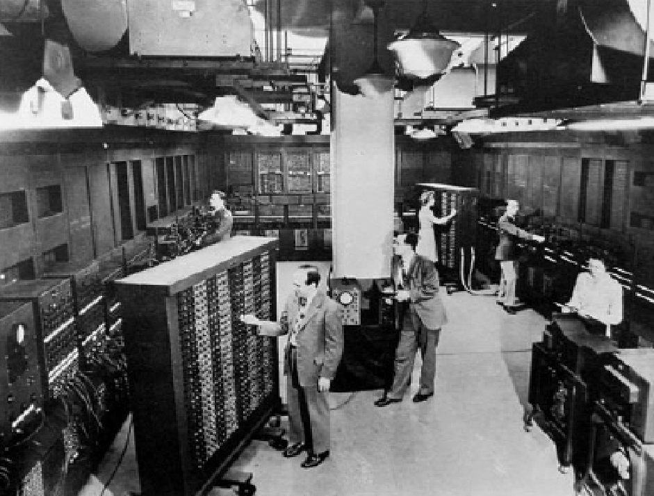

1951年，世界上第一台商品量产的计算机 UNIVAC-I 投产，标志着计算机时代的真正开始

```C

1. （2017年单项选择题）下列关于计算机发现史的叙述中，错误的是
A. 世界上第一台电子计算机是在美国发明的ENIAC
B. ENIAC不是存储程序控制的计算机
C. ENIAC是1946年发明的，所以世界从1946年起就开始了计算机时代
D. 世界上第一台投人运行的具有存储程序控制的计算机是英国人设计并制造的EDSAC
    
```

```

2. （2016年单项选择题）第一台电子计算机是1946年在美国研制的，该机的英文缩写
为_________ 
A. EDSAC B. EDVAC C. ENIAC D. UNIVAC

```

```C

3. （2009年选择题、2012年填空题）世界上第一台公认的计算机是在年诞生的。
A.1846 B.1864 C.1946 D.1964
    
```


####  <span style="color:red;font-weight:bold;">2 计算机的发展</span>

| **年代**                         | **名称**                   | **元件**                           | **语言**                  | **应用**               |
| -------------------------------- | -------------------------- | ---------------------------------- | ------------------------- | ---------------------- |
| **第一代1946～1956**             | **电子管计算机**           | **电子管**                         | **机器语言** **汇编语言** | **科学计算**           |
| **第二代1956～1964**     | **晶体管计算机**           | **晶体管**                         | **高级程序设计语言**      | **数据处理**           |
| **第三代1964～1971** | **集成电路计算机**         | **中小规模集成电路**               | **操作系统和会话式语言**  | **广泛应用到各个领域** |
| **第四代1971年～现在**  | **超大规模集成电路计算机** | **超大规模集成电路计算机集成电路** | **面向对象的高级语言**    | **网络时代**           |
| **第五代**                     | **未来计算机**           | **光子、量子、DNA等**              |                           |                        |

<span style="color:green;font-weight:bold;">☆☆☆ 根据计算机元器件的大小不同，将计算机的发展分为四代，第五代计算机可根据题目具体对待</span>

```AD

1. （2012年多项选择题）计算机发展过程按使用的电子元件可划分为四代，其中第二代和第四代计算机使用的基本元件分别为。
A.晶体管 B.超大规模集成电路
C.电子管 D.集成电路

```

```B

2. （2019年单项选择题）第一代电子计算机采用的电子元器件是
A.晶体管 B.电子管
C.集成电路 D.大规模集成电路

```

```C

3. （2005年选择题）电子计算机的发展过程经历了四代，其划分依据是.
A.计算机体积
C.构成计算机的电子元件
B.计算机速度
D.内存容量
    
```


#### 3 我国计算机的发展历史

我国从1956 年开始研制计算机
1958 年研制出第一台电子管计算机
1964 年研制成功晶体管计算机
1971 年研制成功集成电路计算机
1983 年研制成功每秒运算1 亿次的“银河1”巨型机。
我国先后自主开发了“银河”、“曙光”、“深腾”和“神威”等系列高性能计算机，取得了令人瞩目的成果

在2013 年11 月公布的国际超级计算机前500 强中，中国的<span style="color:red;font-weight:bold;">“天河二号”</span>排名第一。以“联想”、“清华同方”、“方正”和“浪潮”等为代表的我国计算机制造业非常发达，已成为世界计算机主要制造中心之一。我国也是重要的计算机软件生产国家。但我国在计算机的软硬件生产领域存在原创技术少，一些计算机核心技术（如CPU、操作系统等）仍掌握在西方发达国家手中等亟待解决的问题。


### 2.2 计算机的特点及分类

------

#### **1. 计算机的特点**

**1）运算速度快:**计算机的运算部件采用的是电子器件，其运算速度远非其他计算工具所能比拟，而且运算速度还以每隔几个月提高一个数量级的速度在快速发展。

**2）计算精确高：**计算机的可靠性很高，差错率极低，一般来讲只在那些人工介入的地方才有可能发生错误。

**3）存储容量大：**计算机的存储性是计算机区别于其他计算工具的重要特征。

**4）具有逻辑判断能力** **:**借助于逻辑运算，可以让计算机作出逻辑判断，分析命题是否成立，并可根据命题成立与否采取相应的对策。

**5）工作自动化：**计算机内部的操作运算是根据人们预先编制的程序自动控制执行的。

**6）通用性强：**通用性是计算机能够应用于各种领域的基础，任何复杂的任务都可以分解为大量的基本的算术运算和逻辑操作。

<span style="color:green;font-weight:bold;">☆☆☆高大快+智能+自动+通用 </span>

```AD

1. （2019年多项选题）计算机的特点主要有.
A.具有记忆和逻辑判断能力 B.运算速度快，但精确度低
C.可以进行科学计算，但不能处理数据 D.存储容量大、通用性强

```

```BD

2. （2014年多项选择题）计算机的特点有运算速度快以及。
A.安全性高、网络通信能力强 B.工作自动化、通用性强
G.可靠性高、适应性强 D.存储容量大、精确性高

```


#### **<span style="color:gray;font-weight:bold;">2.计算机的分类</span>**

| **根据处理的对象划分** | **模拟计算机、数字计算机和混合计算机**         |
| ---------------------- | ---------------------------------------------- |
| **根据用途划分**       | **专用计算机和通用计算机**                     |
| **根据规模划分**       | **巨型机、大型机**  **小型机、微型机和工作站** |


#### **3.计算机的应用**

**1.** **科学计算（最为原始的应用场景）**

科学计算是指科学和工程中的数值计算。它与理论研究、科学实验一起成为当代科学研究的三种主要方法。主要应用在航天工程、气象、地震、核能技术、石油勘探和密码解译等涉及复杂数值计算的领域。

<span style="color:green;font-weight:bold;">☆☆☆最原始的应用场景 </span>

**2.** **<span style="color:red;font-weight:bold;">信息管理</span>**

是指非数值形式的数据处理，是指以计算机技术为基础，对大量数据进行加工处理，形成有用的信息。被广泛应用于办公自动化、事务处理、情报检索、企业管理和知识系统等领域。信息管理是计算机应用最广泛的领域。

<span style="color:green;font-weight:bold;">☆☆☆一般叫做某某管理系统的软件，均为计算机信息管理方面的应用 </span>

**3.** **过程控制**

又称实时控制，指用计算机及时采集检测数据，按最佳值迅速地对控制对象进行自动控制或自动调节。目前已在冶金、石油、化工、纺织、水电、机械和航天等部门得到广泛应用。 

**4.** **计算机辅助系统**

指通过人机对话，使计算机辅助人们进行设计、加工、计划和学习等工作。 如计算机辅助设计CAD、计算机辅助制造CAM、计算机辅助教育CBE、计算机辅助教学CAI 、 计算机辅助教学管理CMI。另外还有计算机辅助测试CAT和计算机集成制造系统CIMS等。

<span style="color:green;font-weight:bold;">☆☆☆记住单词的最后一个字母（Design、Manufacturing、Education、Instruction、Test、System） </span>

**5.** **人工智能**

人工智能（AI，Artificial Intelligence）是研究怎样让计算机做一些通常认为需要智能才能做的事情，又称机器智能，主要研究智能机器所执行的通常是人类智能的有关功能，如判断、推理、证明、识别、感知、理解、设计、思考、规划、学习和问题求解等思维活动。人工智能是计算机当前和今后相当长的一段时间的重要研究领域 。

**6.** **计算机网络与通信**

利用通讯技术，将不同地理位置的计算机互联，可以实现世界范围内的信息资源共享，并能交互式地交流信息。正所谓“一线联五洲”，Internet的建立和应用使世界变成了一个“地球村”，同时深刻地改变了我们的生活、学习和工作方式。 

**7.** **多媒体技术应用**

多媒体技术应用是当今信息技术领域发展最快、最活跃的技术，是新一代电子技术发展和竞争的焦点。多媒体技术融计算机、声音、文本、图像、动画、视频和通信等多种功能于一体。

**8.** **嵌入式系统**

嵌人式系统是以应用为中心、以计算机技术为基础，软、硬件可裁剪，适应于应用系统对功 能、可靠性、成本、体积、功耗等方面有特殊要求的专用计算机系统。日常生活中水、电、煤气表的 远程自动抄表，就是嵌人式系统的典型应用。远程自动抄表嵌有的专用控制芯片将代替传统的 人工检查，并实现更高、更准确和更安全的性能。

<span style="color:green;font-weight:bold;">☆☆☆一般叫做某某管理系统的软件，均为计算机信息管理方面的应用 </span>

```B

1. （2019年判断题）事务处理、情报检索和知识系统等是计算机在科学计算领域的应用。
A.正确 B.错误

```

```B

2. （2005年单项选择题）随着计算机的飞速发展，其应用范围不断扩大，某学校学生学籍的计算机管理属于 应用领域。
A.科学计算 B.信息管理 C.过程控制 D.计算机

```

```B

3. （2014年单项选择题）将计算机用于天气预报，是其在方面的主要应用。
A.信息管理 B.科学计算 C.自动控制 D.人工智能

```

```B

4. （2018年单项选择题）在计算机辅助系统中，CAM 的含义是。
A.计算机辅助设计
B.计算机辅助制造
C.计算机辅助教学
D.计算机辅助测试 

```


**4 计算机的发展趋势**

**1. 巨型化**

 指不断研制速度更快的、存储量更大的和功能更强大的巨型计算机。主要应用于天文、气象、地质和核技术、航天飞机和卫星轨道计算等尖端科学技术领域，研制巨型计算机的技术水平是衡量一个国家科学技术和工业发展水平的重要标志。

<span style="color:green;font-weight:bold;">☆☆☆科学领域 </span>

**2. 微型化**

指利用微电子技术和超大规模集成电路技术，把计算机的体积进一步缩小，价格进一步降低。计算机的微型化已成为计算机发展的重要方向，各种笔记本电脑和掌上电脑的大量使用，是计算机微型化的一个标志。 

<span style="color:green;font-weight:bold;">☆☆☆民用领域 </span>

**3.** **网格化**

网格（Grid）技术可以更好地管理网上的资源，它把整个互联网虚拟成一台空前强大的一体化信息系统，犹如一台巨型机，在这个动态变化的网络环境中，实现计算资源、存储资源、数据资源、信息资源、知识资源、专家资源的全面共享，从而让用户从中享受可灵活控制的、智能的、协作式的信息服务，并获得前所未有的使用方便性和超强能力。 

<span style="color:green;font-weight:bold;">☆☆☆云化资源、共享网盘、PaaS</span>

**4.** **智能化**

智能化是指让计算机具有模拟人的感觉和思维过程的能力。智能计算机具有解决问题和逻 辑推理的功能，以及知识处理和知识库管理的功能等。人与计算机的联系是通过智能接口，用 字、声音、图像等与计算机自然对话。智能化的研究领域很多，其中最有代表性的领域是专家系统和机器人。

<span style="color:green;font-weight:bold;">☆☆☆AI</span>

```D

1. （2018年单项选择题）计算机的发展趋势不包括。
A.巨型化 B.微型化 C.智能化 D.专业化
    
```

### 2.3 课后任务

------

1 第一台计算机是什么？是哪个国家在什么时间研制成功的？

2 电子计算机发展经历了哪几个阶段？


## **3 计算机中信息的表示**

###  **3.1 信息的表示**

------

信息表示广义来说泛指信息的获取、描述、组织全过程，狭义来说指其中的信息描述过程。

  用于信息表示的符号系统有三个基本特点：  

  第一，存在一个基本的<span style="color:red;font-weight:bold;">有限符号集</span>，符号集中符号的数目多于一个。

  第二，不同符号有明显的<span style="color:red;font-weight:bold;">差别</span>，便于人们识别和感知这些符号。

  第三，存在一组规则，按照规则可以将基本符号组成更<span style="color:red;font-weight:bold;">复杂</span>的结构，如符号串。

```D

1. 符号系统不包含一下哪个特点。
A.有限性 B.差异性 C.组合型 D.扩展性

```

### 3.2 数制及其转换

------

用进位的原则进行计数称为进位计数制，简称数制。它是人类自然语言和数学中广泛使用的一类符号系统。在介绍各种数制之前，首先介绍数制中的几个名词术语。

​    数码：一组用来表示某种数制的符号。如：1、2、3、4、A、B、C、Ⅰ、Ⅱ、Ⅲ、Ⅳ等。

​    基数：数制所使用的数码个数称为“基数”或“基”，常用“R”表示，称为R 进制。如二进制的数码是0、1，基为2。

​    位权：指数码在不同位置上的权值。在进位计数制中，处于不同数位的数码代表的数值不同。如十进制数111，个位数上的1 的权值为100，十位数上的1 的权值为101，百位数上的1 的权值为102。


#### **1 常见的几种进位计数制**

**1. 十进制（Decimal System）：**由0、1、2、…、8、9十个数码组成，即基数为10。特点为：逢十进一，借一当十。 用字母D表示。

**2 . 二进制（Binary System）：**由0、1两个数码组成，即基数为2。二进制的特点为：逢二进一，借一当二。 用字母B表示。 

**3. 八进制（Octal System）：**由0、1、2、3、4、5、6、7八个数码组成，即基数为8。八进制的特点为：逢八进一，借一当八。 用字母O表示。

**4. 十六进制（Hexadecimal System）**：由0、1、2、…、9、A、B、C、D、E、F十六个数码组成，即基数为16。十六进制的特点为：逢十六进一，借一当十六。 用字母H表示。


常见的进制之间的转换关系，十进制、二进制、八进制、十六进制。

| 十进制 | 二进制 | 八进制 | 十六  进制 | 十进制 | 二进制 | 八进制 | 十六  进制 |
| ------ | ------ | ------ | ---------- | ------ | ------ | ------ | ---------- |
| 0      | 0      | 0      | 0          | 9      | 1001   | 11     | 9          |
| 1      | 1      | 1      | 1          | 10     | 1010   | 12     | A          |
| 2      | 10     | 2      | 2          | 11     | 1011   | 13     | B          |
| 3      | 11     | 3      | 3          | 12     | 1100   | 14     | C          |
| 4      | 100    | 4      | 4          | 13     | 1101   | 15     | D          |
| 5      | 101    | 5      | 5          | 14     | 1110   | 16     | E          |
| 6      | 110    | 6      | 6          | 15     | 1111   | 17     | F          |
| 7      | 111    | 7      | 7          | 16     | 10000  | 20     | 10         |
| 8      | 1000   | 10     | 8          | 17     | 10001  | 21     | 11         |


#### <span style="color:red;font-weight:bold;">2 数制及其转换</span>

**<span style="color:red;font-weight:bold;">1. 二进制、八进制、十六进制数转化为十进制数</span>**

​    对于任何一个二进制数、八进制数、十六进制数，均可以先写出它的<span style="color:red;font-weight:bold;">位权</span>展开式，然后再按十进制进行计算即可将其转换为十进制数。

例如：

（1111.11）2= 1×23 + 1×22 + 1×21 + 1×20 + 1×2-1 + 1×2-2 = 15.75

（A10B.8）16= 10×163 + 1×162 + 0×161 + 11×160 + 8×16-1 = 41 227.5 


<span style="color:green;font-weight:bold;">☆☆☆按权展开式 </span>

<span style="color:green;font-weight:bold;">☆☆☆整数位位权=从左到右位数-1，小数位位权=0-从左到右的位数</span>

<span style="color:green;font-weight:bold;">☆☆☆（扩展其他进制转化为十进制）按目标权展开 </span>


**<span style="color:red;font-weight:bold;">2.十进制数转化为二进制数</span>**

十进制数的整数部分和小数部分在转换时需作不同的计算，分别求值后再组合。

整数部分采用除2取余法，即逐次除以2，直至商为0，得出的余数<span style="color:red;font-weight:bold;">倒排</span>，即为二进制各位的数码。

小数部分采用乘2取整法，即逐次乘以2，直到余数为0，从每次乘积的整数部分得到二进制数各位的数码(<span style="color:red;font-weight:bold;">正排</span>)。


**例：将十进制数100. 125转化为二进制数**

**整数位转换**

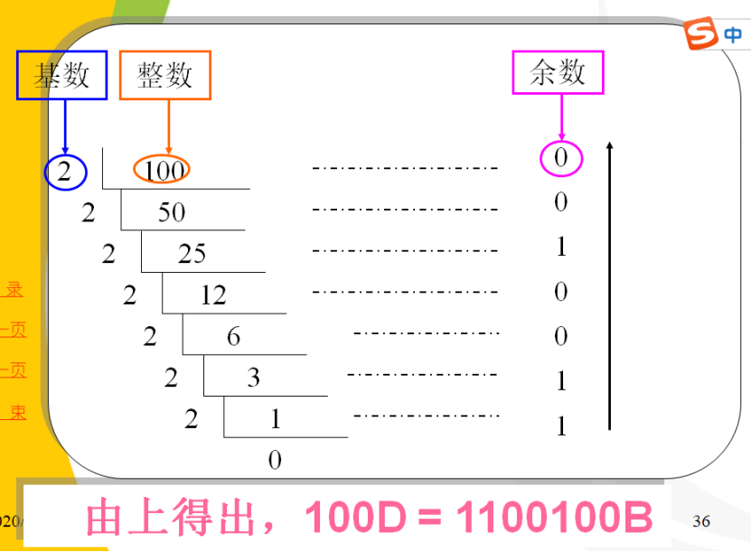


**小数部分0.125的转换**

​       **0.125 ×2 = 0.250                0……a-1**

​       **0.25×2 =0.5                    0……a-2**

​       **0.5 ×2 = 1                     1……a-3**

​       **由上得出，0.125D=0.001B。**

**将整数和小数部分组合，得出：100.125D = 1100100.001B。**


<span style="color:green;font-weight:bold;">☆☆☆直到小数位等于0；2 会有无法转换的情况，因为小数位永远不为0，例如 1.6 </span>

<span style="color:green;font-weight:bold;">☆☆☆整数位：除  2 取余余数倒排；小数位：乘2取整，整数正排</span>

<span style="color:green;font-weight:bold;">☆☆☆（扩展十进制转换为其他进制）整数位：除基数取余余数倒排；小数位：乘基数取整，整数正排</span>


```
 
 356.125D = ()O
 544.1
 
```


#### **<span style="color:red;font-weight:bold;">3. 二进制数与八进制数的相互转换</span>**

将二进制数从小数点开始，对二进制整数部分向左每3位分成一组，不足3位的向高位补0凑成3位；对二进制小数部分向右每3位分成一组，不足3位的向低位补0凑成3位。每一组有3位二进制数，分别转换成八进制数码中的一个数字，全部连接起来即可。

**例：把二进制数11111101.101转化为八进制数。**

| **二进制3位分组**  | 011  | 111  | 101． | 101  |
| ------------------ | ---- | ---- | ----- | ---- |
| **转换为八进制数** | 3    | 7    | 5．   | 5    |

**所以，11111101.101B = 375.5O。**

<span style="color:green;font-weight:bold;">☆☆☆将八进制数转换成二进制数，只要将每一位八进制数转换成相应的3位二进制数，依次连接起来即可。</span>


#### **<span style="color:red;font-weight:bold;">4. 二进制数与十六进制数的相互转换</span>**

二进制数转换成十六进制数，只要把每4位分成一组，再分别转换成十六进制数码中的一个数字，不足4位的分别向高位或低位补0凑成4位，全部连接起来即可。

十六进制数转换成二进制数，只要将每一位十六进制数转换成4位二进制数，然后依次连接起来即可。

**例：将10110001.101B转换为十六进制数。**

| **二进制4位分组**    | **1011** | **0001．** | **1010** |
| -------------------- | -------- | ---------- | -------- |
| **转换为十六进制数** | **B**    | **1．**    | **A**    |

**所以，10110001.101 B = B1.AH。**

<span style="color:green;font-weight:bold;">☆☆☆十六进制数转换成二进制数，只要将每一位十六进制数转换成4位二进制数，然后依次连接起来即可。</span>


#### **5 二进制的运算规则**

**1.算术运算规则**

  加法规则：0 + 0 = 0；    0 + 1 = 1；

​            1 + 0 = 1；    1 + 1 = 10（向高位有进位）；

  减法规则：0 - 0 = 0；    10- 1 = 1 （向高位借位）；

​            1 - 0 = 1；    1 - 1 = 0;

  乘法规则：0×0 = 0；    0×1 = 0；

​            1×0 = 0；    1×1 = 1

  除法规则：0 / 1 = 0；    1 / 1 = 1

```(001)2

2020年真题
31.二进制运算：（110）2 -（101）2 =___________。

```

<span style="color:green;font-weight:bold;">☆☆☆与十进制的算数运算一致 </span>


**2.逻辑运算规则**

**非运算（NOT）：**

**与运算（AND）：0∧0 = 0；   0∧1 = 0；1∧0 = 0；   1∧1 = 1;**

**或运算（OR）：  0∨0 = 0；   0∨1 = 1；1∨0 = 1；   1∨1 = 1;**

**异或运算（XOR）：0⊕0=0； 0⊕1=1；1⊕0=1； 1⊕1=0;**


<span style="color:green;font-weight:bold;">☆☆☆（1）记清楚每一个逻辑运算的符号 </span>

<span style="color:green;font-weight:bold;">☆☆☆（2）与或非相对好理解，异或可以理解为只要表达式两端的不同就等于1 </span>


```A

1. （2019年选择题）将十进制数56转换成二进制数是
A. 111000 B. 000111 C. 101010

```

```99

2. （2018年填空题）二进制数“1100011”对应的十进制数是?

```

```c

3. （2018年单项选择题）8位无符号二进制数可以表示的最大十进制整数是?
A. 127 B.128 C.255 D.256
    
```

> 8位无符号二进制数可以表示的最大二进制整数是11111111,将 二进制数11111111转换为十进制数即可。因为二进制数11111111+1 = 100000000 则二进制数 11111111 =100000000 -1 =1 x2<sup>9-1</sup> -1 =2 <sup>8</sup> -1
> <span style="color:red;font-weight:bold;">同理N位无符号二进制数可以表示的最大十进制数是2<sup>N -1</sup>。</span>

```A

4. (2017年单项选择题)人们通常用十六进制，而不用二进制书写计算机中的数，是因
为_________ 
A.十六进制的书写比二进制方便 B.十六进制的运算规则比二进制简单
C.十六进制数表达的范围比二进制大 D.计算机内部采用的是十六进制

```

```66.6

5. (2016年填空题)二进制数110110.11的等值八进制数是?

```

```B

6. 十六进制数3C7.D8转换为二进制数是。
A. 1111010111.11101 B.1111000111.11011
C.111001111.11001 D.111100111.110101

```

```B

7.（2004年选择题）下列数中，有可能是八进制数的是。
A.488 B.717 C.187 D. 379

```

```D

8.（2004年选择题）下列说法错误的是。
A. 任何二进制都可以用十进制来准确表示
B. 任何二进制小数都可以用十进制来准确表示
C. 任何十进制整数都可以用二进制来准确表示
D. 任何十进制小数都可以用二进制来准确表示

```


### **3.3 信息的编码**

------

#### **<span style="color:red;font-weight:bold;">1. 计算机中数据的单位</span>**

​    **1）位（bit）**

​    简记为b，也称为比特，是计算机存储数据的最小单位。一个二进制位只能表示0或1。

​    **2）字节（Byte）**

​    字节来自英文Byte，简记为B。字节是存储信息的基本单位。规定1B=8bit。

​    1 KB =210 B= 1024B    1 MB = 220 B= 1024KB

​    1 GB = 230 B= 1024MB  1 TB = 240 B = 1024GB


<span style="color:green;font-weight:bold;">☆☆☆（1）比特，是计算机存储数据的最小单位 </span>

<span style="color:green;font-weight:bold;">☆☆☆（2）比特，字节是存储信息的基本单位 </span>

<span style="color:green;font-weight:bold;">☆☆☆（3）计算机存储能力越来越大，为了方便记录和表达，有了 KB MB GB TB，类似于 厘米 分米 米</span>

<span style="color:green;font-weight:bold;">☆☆☆ （4）KB = 1024B  并不是 1000</span>


```D

1. (2018年单项选择题)下列描述中，正确的是。
A. 1KB = 1000B B. 1KB = 1024 x 1024B
C. 1MB =1024B D. 1MB = 1024xl024B
    
```


```C

2. (2018年单项选择题)计算机中，通常用英文字母“bit”表示.
A.字
C.二进制位
B.字节
D.字长

```

   

```A

3. (2016年判断题)一个字节(Byte)占8个二进制位。
A.正确 B.错误

```

```C

4.（2010年选择题）存储容量1GB等于。
A. 1024B B. 1024KB C. 1024MB D. 1000MB
    
```


**3）字（Word）**

​    一个字通常由一个字节或若干个字节组成。

​    **字长是计算机一次所能处理的实际位数长度，字长是衡量计算性能的一个重要指标。** 

```
2020 年真题
32.内存容量为8GB，其中B指___________。
字节(Byte) 
```

<span style="color:green;font-weight:bold;">☆☆☆（1）字长是衡量计算性能的重要指标 </span>

<span style="color:green;font-weight:bold;">☆☆☆（2）下载计算机软件的时候，一般会询问你下载 32 位还是 64 位的软件，这里的位数说的就是字长 </span>

#### **2.** **数值的表示**

 通常规定一个数的最高位作为符号位，<span style="color:red;font-weight:bold;text-decoration:underline">“0”表示正，“1”表示负</span>。采用二进制表示形式的连同数符一起代码化了的数据称为机器数；而与机器数对应的用正、负符号加绝对值来表示的实际数值称为真值。例如作为有符号数，机器数01111111的真值是+1111111，也就是+127。

为了在计算机的输入输出操作中能直观迅速地与常用的十进制数相对应，习惯上用二进制代码表示十进制数，这种编码方法简称BCD码或8421编码。例如，对于(239)10的编码如下： 

| **十进制数** | **2**    | **3**    | **9**    |
| ------------ | -------- | -------- | -------- |
| **8421编码** | **0010** | **0011** | **1001** |

<span style="color:green;font-weight:bold;">☆☆☆（1）BCD 或者 8421 编码就是用 二进制数表示十进制数值 </span>

```最高位

（2016年填空题）通常规定一个数的（）作为符号位，“0”表示正，“ 1”表示负。

```

#### **3. 文字信息的表示**

**1）字符编码：**

目前采用的字符编码主要是ASCII码，它是American Standard Code for Information Interchange的缩写（美国标准信息交换代码），已被国际标准化组织ISO采纳，作为国际通用的信息交换标准代码。ASCII码是一种西文机内码，有7位ASCII码和8位ASCII码两种，7位ASCII码称为标准ASCII码，8位ASCII码称为扩展ASCII码。<span style="color:red;font-weight:bold;text-decoration:underline">7位标准ASCII码用一个字节（8位）表示一个字符，并规定其最高位为0，实际只用到7位，因此可表示128个不同字符。同一个字母的ASCII码值小写字母比大写字母大32（20H）</span>。

<span style="color:green;font-weight:bold;">☆☆☆00000000->01111111 = 128 </span>

<span style="color:green;font-weight:bold;">☆☆☆ASCII 码设计的时候并没有考虑汉字 </span>

<span style="color:green;font-weight:bold;">☆☆☆七位较为标准 ASCII 码，八位叫做扩展 ASCII 码 </span>

<span style="color:green;font-weight:bold;">☆☆☆小写字母比大写字母的 ASCII码值大 32 </span>

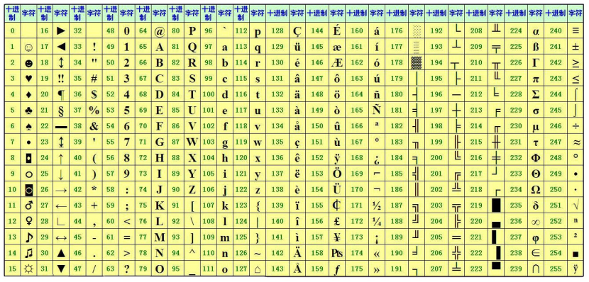

```ASCII

1.（2019年填空题、2005年填空题）计算机中英文字符的最常用编码是码
American Standard Code for Information Interchange

```

**2）汉字编码**

**A. 汉字交换码**：

由于汉字数量极多，一般用连续的<span style="color:red;font-weight:bold;text-decoration:underline"> 两个字节 </span>（16个二进制位）来表示一个汉字。1980年，我国颁布了第一个汉字编码字符集标准，即 <span style="color:red;font-weight:bold;text-decoration:underline">GB2312-80</span>《信息交换用汉字编码字符集基本集》，该标准编码简称国标码，是我国大陆地区及新加坡等海外华语区通用的汉字交换码。<span style="color:red;font-weight:bold;text-decoration:underline">GB2312-80</span> 收录了6763个汉字，以及682符号，共7445个字符，奠定了中文信息处理的基础。

<span style="color:green;font-weight:bold;">☆☆☆交换码又称国标码，但与计算机内汉字的真实编码不一样 </span>

<span style="color:green;font-weight:bold;">☆☆☆汉字一般占两个字节</span>

**B.** **汉字机内码：**

国标码GB2312不能直接在计算机中使用，以为它没有考虑与基本的信息交换代码ASCII码的冲突。比如：“大”的国标码是3473H，与字符组合“4S”的ASCII相同,“嘉,”的汉字编码为3C4EH,与码值为3CH和4EH的两个ASCII字符“<”和“N”混淆。为了能区分汉字与ASCII码，在计算机内部表示汉字时把交换码（国标码）两个字节最高位改为1，称为“机内码”。这样，<span style="color:red;font-weight:bold;">当某字节的最高位是1时，必须和下一个最高位同样为1的字节合起来，代表一个汉字</span>。

<span style="color:green;font-weight:bold;">☆☆☆计算机内部存储的真实码值 </span>


**C.汉字字形码：**

所谓汉字字形码实际上就是用来将汉字显示到屏幕上或打印到纸上所需要的图形数据。

 汉字字形码记录汉字的外形，是汉字的输出形式。记录汉字字形通常有两种方法：点阵法和矢量法，分别对应两种字形编码：点阵码和矢量码。所有的不同字体、字号的汉字字形构成汉字库。

点阵码是一种用点阵表示汉字字形的编码，它把汉字按字形排列成点阵，一个16×16点阵的汉字要占用32个字节，一个32×32点阵的汉字则要占用128字节，而且点阵码缩放困难且容易失真。  

<span style="color:green;font-weight:bold;">☆☆☆点阵（易失真）、矢量 </span>

**D. 汉字输入码：**

 将汉字通过键盘输入到计算机采用的代码称为汉字输入码，也称为汉字外部码（外码）。汉字输入码的编码原则应该易于接受、学习、记忆和掌握，重码少，码长尽可能短。

目前我国的汉字输入码编码方案已有上千种，但是在计算机上常用的有几种，根据编码规则，这些汉字输入码可分为流水码、音码、形码和音形结合码四种。智能ABC、微软拼音、搜狗拼音和谷歌拼音等汉字输入法为音码，五笔字型为形码。音码重码多、单字输入速度慢，但容易掌握；形码重码较少，单字输入速度较快，但是学习和掌握较困难。目前以智能ABC、微软拼音、紫光拼音输入法和搜狗输入法等音码输入法为主流汉字输入方法。 

<span style="color:green;font-weight:bold;">☆☆☆可以理解为不同的输入法，其中流水码是是唯一没有重码的输入码，但是需要大量记忆 </span>

<span style="color:green;font-weight:bold;">☆☆☆交换码、机内码、字形码、输入码 </span>


```A

1. （2019年单项选择题）汉字信息交换码是我国颁布的国家标准。
A. GB2312-80 B.UTF-8 C.原码 D.补码

```

```B 机内码

2. （2017年判断题）汉字在计算机内部表示时采用的是国标码。
A.正确 B.错误

```

```A

3. （2015年选择题）国标码 GB2312-80 是国家制定的汉字（）标准。
A.交换码 B.机内码 C.字型码 D.输人码

```

```C

4. （2007年选择题）计算机内处理汉字信息时所用的汉字代码是。
A.汉字字形码 B.汉字输人码 C.汉字机内码 D.汉字交换码

```

```D

5. （2005年选择题）关于汉字操作系统中的汉字输人码，下面叙述正确的是。
A. 汉字输入码应具有易于接受、学习和掌握的特点
B. 从汉字的特征出发，汉字输人码可分为音码、形码和音形结合码
C. 汉字输人码与我国制定的“标准汉字”（GB2312 -80）不是一个概念
D. A、B、C 都对

```


### 3.4 课后任务

1 阐述二进制与八进制、十进制、十六进制的转换方式？

2 计算机中数据单位有哪些？

## **4 计算机系统**


计算机系统主要包含硬件系统和软件系统两个部分

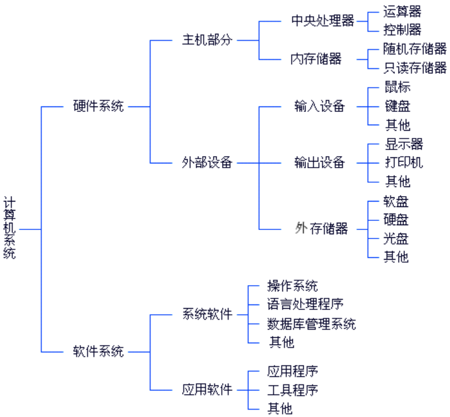


### **4.1 **计算机工作原理

------

#### **1 指令**

是指示计算机执行某种操作的命令，它由一串二进制数码组成，这串二进制数码包括<span style="color:red;font-weight:bold;">操作码和地址码两部分</span>。操作码规定了操作的类型，即进行什么样的操作；地址码规定了要操作的数据（操作对象）存放在什么地址中，以及操作结果存放到哪个地址中去。

 一台计算机有许多指令，作用也各不相同。所有指令的集合称为<span style="color:red;font-weight:bold;">计算机指令系统</span>。计算机系统不同，指令系统也不同，目前常见的指令系统有<span style="color:red;font-weight:bold;">复杂指令系统（CISC）</span>和<span style="color:red;font-weight:bold;">精简指令系统（RISC）</span>。

<span style="color:green;font-weight:bold;">☆☆☆计算机指令集合定义了计算机所能提供的功能的总和 </span>

<span style="color:green;font-weight:bold;">☆☆☆不同计算机体系结构、硬件结构不同、指令集不同 </span>

<span style="color:green;font-weight:bold;">☆☆☆复杂指令 CISC 、精简指令系统 RISC </span>

#### 2 存储程序工作原理

计算机能够自动完成运算或处理过程的基础是“存储程序”工作原理。“存储程序”工作原理是美籍匈牙利科学家<span style="color:red;font-weight:bold;text-decoration:underline">冯·诺依曼</span>（Von Neumann）提出来的，故称为冯·诺依曼原理，其基本思想是<span style="color:red;font-weight:bold;text-decoration:underline">存储程序</span>与<span style="color:red;font-weight:bold;text-decoration:underline">程序控制</span>。

<span style="color:red;font-weight:bold;text-decoration:underline">存储程序</span>是指人们必须事先把计算机的执行步骤序列（即程序）及运行中所需的数据，通过一定方式输入并存储在计算机的存储器中；

<span style="color:red;font-weight:bold;text-decoration:underline">程序控制</span>是指计算机运行时能自动地逐一取出程序中的一条条指令，加以分析并执行规定的操作。 

到目前为止，尽管计算机发展到了第四代，但其基本工作原理仍然没有改变。<span style="color:red;font-weight:bold;">根据存储程序和程序控制的概念，在计算机运行过程中， 实际上有数据流跟控制信号两种信息在流动</span>。 

<span style="color:green;font-weight:bold;">☆☆☆冯诺依曼原理、冯诺依曼体系结构：程序控制和程序存储 </span>

<span style="color:green;font-weight:bold;">☆☆☆计算机之父：19世纪 查尔斯-巴贝奇 最先提出了通用数字计算机的基本思想</span>

<span style="color:green;font-weight:bold;">☆☆☆电子计算机之父：冯诺依曼</span>

<span style="color:green;font-weight:bold;">☆☆☆冯诺依曼三大贡献：1 提出了存储控制原理 2 因为存储控制原理决定了计算机硬件系统由五个部分组成 3 提出了二进制的思想</span>

```D

1. （2018年单项选择题）将程序像数据一样存放在计算机中运行，是1946年由提___出的。
A.图灵 B.布尔 C.爱因斯坦 D.冯•诺依曼
    
```

```AB

2. （2018年多项选择题）冯•诺依曼原理的基本思想是
A.存储程序 B.程序控制 C.科学计算 D.人工智能

```

```BC

3. （2015年多项选择题）指令是指示计算机执行某种操作的命令，它包括两部分。
A.指令地址 B.操作码 C.地址码 D.寄存器地址

```

#### **3 计算机的工作过程**

计算机的工作过程可以归结为以下几步：

（1）取指令。即按照指令计数器中的地址，从内存储器中取出指令，并送到指令寄存器中。

（2）分析指令。即对指令寄存器中存放的指令进行分析，确定执行什么操作，并由地址码确定操作数的地址。

（3）执行指令。即根据分析的结果，由控制器发出完成该操作所需要的一系列控制信息，去完成该指令所要求的操作。

（4）上述步骤完成后，指令计数器加1，为执行下一条指令做好准备。

### **4.2 计算机硬件系统**

**硬件**指的是计算机系统中由电子、机械和光电元件等组成的各种计算机部件和计算机设备。这些部件和设备依据计算机系统结构的要求，构成一个有机整体，称为计算机硬件系统。

未配置任何软件的计算机叫<span style="color:red;font-weight:bold;text-decoration:underline">裸机</span>，它是计算机完成工作的物质基础。


**冯·诺依曼（Von Neumann）提出的存储程序工作原理决定了计算机硬件系统由以下<span style="color:red;font-weight:bold;text-decoration:underline">五个</span>基本部分组成。**

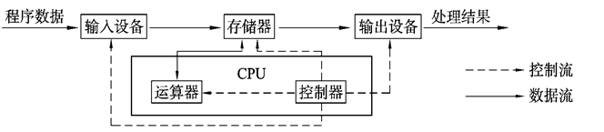


<span style="color:green;font-weight:bold;">☆☆☆控制器、运算器、存储器、输入设备、输出设备 </span>


#### **1. 输入设备**

主要功能是把原始数据和处理这些数据的程序转换为计算机能够识别的<span style="color:red;font-weight:bold;text-decoration:underline">二进制</span>代码，通过输入接口输入到计算机的存储器中，供CPU调用和处理。常用的输入设备有：鼠标器、键盘、扫描仪、数字化仪、数码摄像机、条形码阅读器、数码相机、A/D转换器等

<span style="color:green;font-weight:bold;">☆☆☆找好参考点 </span>

```CD

1. （2017年多项选择题）下列设备中属于输人设备的是。
A.显示器 B.绘图仪 C.鼠标器 D.扫描仪

```


#### **2.** **运算器**

运算器由<span style="color:red;font-weight:bold;text-decoration:underline">算术逻辑单元(ALU, Arithmetic Logic Unit)和寄存器</span>等组成。运算器的功能是完成算术运算和逻辑运算。算术运算是指加、减、乘、除及它们的复合运算。而逻辑运算是指 “与”、“或”、“非”等逻辑比较和逻辑判断等操作。在计算机中，<span style="color:red;font-weight:bold;text-decoration:underline">任何</span>复杂运算都转化为基本的算术与逻辑运算，然后在运算器中完成。

负责对信息进行加工和运算，它的速度决定了计算机的运算速度。参加运算的数（称为操作数）由控制器指示从存储器或寄存器中取出到运算器。

```算数运算

1. （2016年填空题）计算机的运算器是对数据进行_和逻辑运算的部件。

```


#### **3.** **控制器**

<span style="color:red;font-weight:bold;text-decoration:underline">是整个计算机系统的控制中心</span>，它指挥计算机各部分协调工作，保证计算机按照预先规定的目标和步骤有条不紊地进行操作及处理。

控制器是计算机的指挥系统，它的基本功能是从内存取指令和执行指令。控制器通过地址 访问存储器、逐条取出选中单元的指令，分析指令，并根据指令产生的控制信号作用于其它各部 件来完成指令要求的工作。上述工作周而复始，保证了计算机能自动连续地工作。 通常将运算器和控制器统称为中央处理器，即CPU( Central Processing Unit)，它是整个计算 机的核心部件，是计算机的“大脑”。它控制了计算机的运算、处理、输入和输出等工作。

<span style="color:green;font-weight:bold;">☆☆☆通常把控制器和运算器合称为中央处理器（CPU，Central Processing Unit）,它是计算机的核心部件</span>

<span style="color:green;font-weight:bold;">☆☆☆控制器是领导、运算器是干活的小兵</span>

```A

1. （2008年单项选择题）在计算机中负责控制和协调计算机各部件自动、连续地进行工作的部件是?
A.控制器 B.运算器 C.存储器 D.总线

```


#### **4. 存储器** 

是具有<span style="color:red;font-weight:bold;text-decoration:underline">“记忆”</span>功能的设备，由具有两种稳定状态的物理器件（也称为记忆元件）来存储信息。记忆元件的两种稳定状态分别表示为“0”和“1”。存储器是由成千上万个<span style="color:red;font-weight:bold;text-decoration:underline">“存储单元”</span>构成的，每个存储单元存放一定位数（微机上为8位）的二进制数，每个存储单元都有<span style="color:red;font-weight:bold;text-decoration:underline">唯一</span>的地址。“存储单元”是基本的存储单位，不同的存储单元是用不同的地址来区分的。计算机采用按地址访问的方式到存储器中存数据和取数据，计算机中的程序在执行的过程中，每当需要访问数据时，就向存储器送去指定位置的地址，同时发出一个“存”命令或者“取”命令（伴以待存放的数据）。

<span style="color:green;font-weight:bold;">☆☆☆存储单元是 字节</span>

```存储单元的地址

4. （2016年填空题）内存中的每一个存储单元都被赋予一个唯一的序号，该序号称为________

```


**存储器分为两大类：**内存储器和外存储器，简称内存和外存。内存储器又称为主存储器，外存储器又称为辅助存储器。

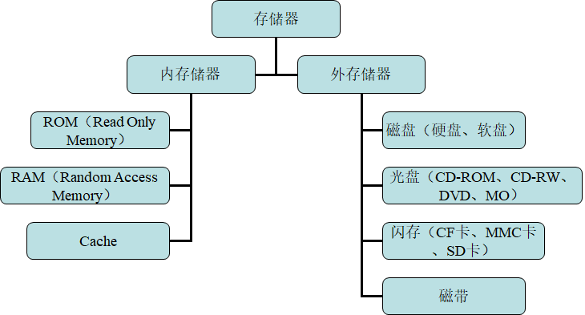


**内存储器:ROM、RAM 和Cache**

（1） 只读存储器（ ROM）： 

ROM 中的数据或程序一般是在将ROM 装入计算机前事先写好的。一般情况下，计算机工作过程中只能从ROM 中读出事先存储的数据，而不能改写。<span style="color:red;font-weight:bold;text-decoration:underline">ROM 常用于存放固定的程序和数据，并且断电后仍能长期保存。ROM 的容量较小</span>，一般存放系统的基本输入输出系统（ BIOS） 等。

<span style="color:green;font-weight:bold;">☆☆☆Read Only Memory</span>

<span style="color:green;font-weight:bold;">☆☆☆都只读了，如果断点就没有了，怎么搞呢</span>

<span style="color:orange;font-weight:bold;">☆☆☆BIOS是英文"Basic Input Output System"的缩略词，直译过来后中文名称就是"基本输入输出系统"。在IBM PC兼容系统上，是一种业界标准的固件接口。 [1]  BIOS这个字眼是在1975年第一次由CP/M操作系统中出现。 [2]  BIOS是个人电脑启动时加载的第一个软件。其实，它是一组固化到计算机内主板上一个ROM芯片上的程序，它保存着计算机最重要的基本输入输出的程序、开机后自检程序和系统自启动程序，它可从CMOS中读写系统设置的具体信息。</span>


```AB

1. （2016年多项选择题）下列说法中，哪两句是不正确的。
A. ROM是只读存储器，其中的内容只能读一次，下次再读就读不出来了
B. 硬盘通常安装在主机箱内，所以硬盘属于内存
C. CPU不能直接与外存打交道
D. 计算机突然停电，则RAM中的数据会全部丢失

```

（2） 随机存储器（ RAM）： 

随机存储器的容量与ROM 相比要大得多，目前微机一般配置1 GB 左右。CPU 从RAM 中既可读出信息又可写入信息，但断电后所存的信息就会丢失。

 微机中的内存一般指随机存储器（ RAM）。目前常用的内存有SDRAM、DDR SDRAM、DDR2、DDR3 等。

<span style="color:green;font-weight:bold;">☆☆☆Random Access Memory

<span style="color:green;font-weight:bold;">☆☆☆断电之后数据就会丢失</span></span>


```A

1. （2019年判断题）RAM的特点是断电后所存的信息会丢失。
A.正确 B.错误

```

```C

2.（2018年单项选择题）下列属于存储器且断电后信息全部丢失的是。
A. ROM B. EPROM C. RAM D. CD - ROM
    
```


（3） 高速缓存（ Cache）： 

随着CPU 主频的不断提高，CPU 对RAM 的存取速度加快了，而RAM 的响应速度相对较慢，造成了CPU 等待，降低了处理速度，浪费了CPU 的能力。

为协调二者之间的速度差，在内存和CPU 之间设置一个与CPU 速度接近的、高速的、容量相对较小的存储器，把正在执行的指令地址附近的一部分指令或数据从内存调入这个存储器，供CPU 在一段时间内使用。

这对提高程序的运行速度有很大的作用。这个介于内存和CPU 之间的高速小容量存储器称作高速缓冲存储器（ Cache），一般简称为缓存。

<span style="color:green;font-weight:bold;">☆☆☆协调 CPU 与 内存之间的速度差距</span>

```B

1. （2014年选择题）微型计算机存储器系统中的 Cache 是。
A. 只读存储器
B. 高速缓冲存储器
C. 可编程只读存储器
D. 可擦除可再编程只读存储器

```

```C

2. （2013年单项选择题）配置高速缓冲存储器（Cache）是为了解决。
A. 内存和外存之间速度不匹配问题
B. CPU和外存之间速度不匹配问题
C. CPU和内存之间速度不匹配问题
D. 主机和外设之间速度不匹配问题

```


**外存**

外存是主机的外部设备，存取速度较内存慢得多，用来存储大量的暂时不参加运算或处理的数据和程序，一旦需要，可成批地与内存交换信息。

<span style="color:green;font-weight:bold;">外存是内存储器的后备和补充，不能和CPU 直接交换数据。</span>

#### **5.** **输出设备**

是指从计算机中输出信息的设备，其功能是将计算机处理的数据、计算结果等内部信息转换成人们习惯接受的信息形式（如字符、图形、声音等），然后将其输出。

最常用的输出设备是显示器、打印机和音箱，还有绘图仪、各种数模转换器（D/A）等。

<span style="color:red;font-weight:bold;">从信息的输入输出角度来说，磁盘驱动器和磁带机既可以看作输入设备，又可以看作输出设备。</span>


```BC

1. (2018年多项选择题)下列属于输出设备的是。
A.键盘 B.打印机 C.显示器 D.扫描仪

```


### **4.3 计算机软件系统**

输入计算机的信息一般有两类，一类称为数据，一类称为程序 。计算机是通过<span style="color:green;font-weight:bold;">执行程序</span>所规定的各种指令来处理各种数据的。

<span style="color:green;font-weight:bold;">☆☆☆程序是告诉计算机怎么完成一件事情、数据是这件事情的描述信息</span>


------

#### **1. 计算机软件基础**

**软件**是指使计算机运行所需的<span style="color:green;font-weight:bold;">程序、数据和有关文档的总和</span>。计算机软件通常分为系统软件和应用软件两大类，系统软件一般由软件厂商提供，应用软件是为解决某一问题而由用户或软件公司开发的。

<span style="color:green;font-weight:bold;">☆☆☆具体问题的指令序列称为程序，数据是程序处理的对象，文 档则是对程序的解释和说明</span>


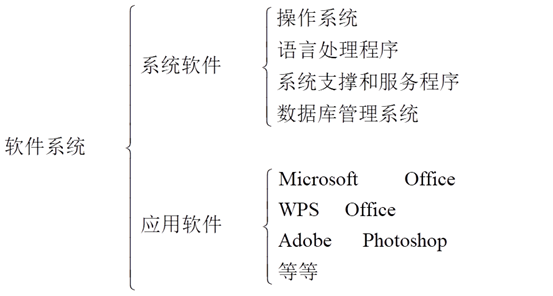

```D

1. （2015年单项选择题）软件是指使计算机运行所需的程序、数据和有关文档的总和。计算机软件通常分为两大类。
A.高级语言和机器语言 B.硬盘文件和光盘文件
C.可执行和不可执行 D.系统软件和应用软件

```


**1）系统软件:** 是管理、监控和维护计算机资源（包括硬件和软件）、开发应用软件的软件。系统软件居于计算机系统中最靠近硬件的一层，它主要包括操作系统、语言处理程序、数据库管理系统、支撑服务软件等。

```D

1. （2019年单项选择题）下列不属于系统软件的是。
A.数据库管理系 B.操作系统
C.程序语言处理系统 D.电子表格处理软件

```

**2）应用软件:** 是为解决计算机各类应用问题而编写的软件，随着计算机应用领域的不断拓展和计算机应用的广泛普及，各种各样的应用软件与日俱增，如办公类软件Microsoft Office、WPS Office、永中office、谷歌在线办公系统；图形处理软件Photoshop、illustrate；三维动画软件3dmax、Maya等；即时通信软件QQ、MSN、UC和Skype等。

<span style="color:green;font-weight:bold;">☆☆☆考点：判断哪些软件是系统软件、哪些是应用软件：记住系统软件的分类（系统软件、语言处理软件、系统支撑服务、数据库管理软件，都是一些不太常接触到的软件系统），剩下的全部是应用软件</span>

```B

1. （2016年单项选择题）下列软件中，属于应用软件的有。
A. Windows B. Word C.编译程序 D. Unix

```

**系统软件分类**

**A.操作系统（OS，Operating System）**

是一组对计算机资源进行控制与管理的系统化程序集合，它是用户和计算机硬件系统之间的接口，为用户和应用软件提供了访问和控制计算机硬件的桥梁。

<span style="color:green;font-weight:bold;">☆☆☆操作系统是直接运行在裸机上的最基本的系统软件，任何其他软件必须在操作系统的支持下才能运行</span>

```A

1. （2019年单项选择题）计算机软件系统中，最核心的软件是。
A.操作系统 B.数据库管理系统
C.语言和处理程序 D.诊断程序

```

**B.** **语言处理程序：**用各种程序设计语言编写的源程序，计算机是不能直接执行的，必须经过翻译（对汇编语言源程序是汇编，对高级语言源程序则是编译或解释）才能执行，这些翻译程序就是语言处理程序，包括汇编程序、编译程序和解释程序等，它们的基本功能是把用面向用户的高级语言或汇编语言编写的源程序翻译成机器可执行的二进制语言程序。

**C. 系统支撑和服务程序:** 这些程序又称工具软件，如系统诊断程序、调试程序、排错程序、编辑程序、查杀病毒程序等等，都是为维护计算机系统的正常运行或支持系统开发所配置的软件系统。

**D. 数据库管理系统:**主要用来建立存储各种数据资料的数据库，并进行操作和维护。   

常用的数据库管理系统有微机上的FoxPro、 FoxBASE+、Access和大型数据库管理系统如Oracle、DB2、Sybase、SQL Server等，它们都是关系型数据库管理系统。


**应用软件分类**

为解决计算机各类应用问题而编写的软件称为**应用软件。**应用软件具有很强的实用性。随着计算机应用领域的不断拓展和计算机应用的广泛普及，各种各样的应用软件与日俱增，如办公类软件Microsoft Office、WPS Office、永中office、谷歌在线办公系统；图形处理软件Photoshop、illustrate；三维动画软件3dmax、Maya等；即时通信软件QQ、MSN、UC和Skype等。只为完成某一特定专业的任务，针对某行业、某用户的特定需求而专门开发的软件，如某个公司的管理系统<span style="color:red;font-weight:bold;text-decoration:underline">（注意：管理系统是我们经常可以接触到的软件：学籍管理系统、药品管理系统）</span>等，都是应用软件。


#### **2. 程序设计语言**

**1）程序设计基础**

​    **数据结构和算法是程序最主要的两个方面，通常可以认为：程序=算法+数据结构。**

​    **算法**可以看作是由有限个步骤组成的用来解决问题的具体过程。实质上反映的是解决问题的思路。其主要性质表现在：①有穷性；②确定性；③可行性 ④输入/输出（必须）。

   **数据结构**是从问题中抽象出来的数据之间的关系，它代表信息的一种组织方式，用来反映一个数据的内部结构。数据结构是信息的一种组织方式，其目的是提高算法的效率，它通常与一组算法的集合相对应，通过这组算法集合可以对数据结构中的数据进行某种操作。典型的数据结构包括线性表、堆栈和队列。

**2）程序设计语言可以分为三类：机器语言、汇编语言和高级语言**

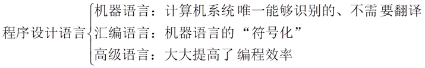

**机器语言**是计算机系统唯一能识别的、不需要翻译直接供机器使用的程序设计语言。用机器语言编写程序难度大、直观性差、容易出错，修改、调试也不方便。由于不同计算机的指令系统不同，针对某一种型号的计算机所编写的程序就不能在另一计算机上运行，所以机器语言的通用性和移植性较差。

<span style="color:green;font-weight:bold;">☆☆☆用机器语言编写的程序具有充分发挥硬件功能的特点，程序也容易编写得紧凑，程序运行速度快。 </span>


**汇编语言**是机器语言的“符号化”。汇编语言和机器语言基本上是一一对应的，但在表示方法上作了改进，用一种助记符来代替操作码，用符号来表示操作数地址（地址码）。例如，用“ADD”表示加法，用“MOVE”表示传送等。用助记符和符号地址来表示指令，容易辨认，给程序的编写带来了很大的方便。

汇编语言比机器语言直观，容易记忆和理解，用汇编语言编写的程序比机器语言程序易读、易检查、易修改。但是它仍然是属于面向机器的语言，它依赖于具体的机器，很难在系统间移植，所以这样的程序的编写仍然比较困难，程序的可读性也比较差。   

<span style="color:green;font-weight:bold;">

```
操作：寄存器BX的内容送到AX中
  
1000100111011000             机器语言
  
mov ax,bx                    汇编语言

if(1>1){
	ax = bx;                 高级语言
}
```

☆☆☆机器语言和汇编语言一般都称为低级语言。</span> 


**高级语言**屏蔽机器的细节，与具体的计算机指令系统无关的、表达方式或接近于人们对求解过程或问题的描述方式，易于理解和掌握的程序设计语言称为高级语言。高级语言有两类，分别是**解释型**和**编译型**。

   ① 解释程序：解释程序接受用某种程序设计语言（如Basic语言）编写的源程序，然后对源程序的每条语句逐句进行解释并执行，最后得出结果。解释程序对源程序是一边翻译，一边执行，不产生目标程序。

   ② 编译程序：编译程序是翻译程序，它将用高级语言编写的源程序翻译成与之等价的用机器语言表示的目标程序，其翻译过程称为编译。

<span style="color:green;font-weight:bold;">☆☆☆编译型语言系统在执行速度上都优于解释型语言系统。但是，编译程序比较复杂，这使得开发和维护费用较高。</span>


<span style="color:green;font-weight:bold;">☆☆☆机器语言->汇编语言->高级语言</span>

<span style="color:green;font-weight:bold;">☆☆☆机器语言对机器友好，对人不友好，对机器友好所以速度快，性能高</span>

<span style="color:green;font-weight:bold;">☆☆☆算法性质：①有穷性；②确定性；③可行性</span>


```D

1. （2019年单项选择题）下列关于计算机语言的描述中，错误的是
A. 计算机可以直接执行的是机器语言程序
B. 汇编语言是一种依赖于计算机的低级语言
C. 高级语言可读性好、数据结构丰富
D. 与低级语言相比，高级语言程序的执行效率高

```

```C

2. （2016年单项选择题）以下属于高级语言的是。
A.汇编语言 B. C语言 C.机器语言 D.以上都是

```

### **4.4 课后作业**

1 计算机硬件包含哪几个部分？分别有什么特点？

2 存储器包含哪几种类型？分被有什么特点？

3 内存存储器有哪些类型？分别有什么特点？

4 计算机程序语言经历那些阶段，各个阶段有哪些特点

5 什么是语言处理程序？其最主要的两个方面是什么？

6 什么是软件？什么是系统软件？什么是应用软件？请各举 3 个例子。

##  5 **微型计算机系统** 

### **5.1 微型计算机分类**

------

按照处理机的位数，可将微型计算机分为 1 位 2位 4位 8位和 16位

微型计算机按其性能、结构、技术特点等可分为：

**（1）单片机：**将微处理器（CPU）、一定容量的存储器以及I/O接口电路等集成在一个<span style="color:red;font-weight:bold;">芯片</span>上，就构成了单片机。

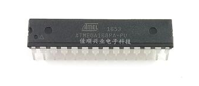


**（2）单板机：**将微处理器、存储器、I/O接口电路安装在一块印刷<span style="color:red;font-weight:bold;">电路板</span>上，就成为单板机。

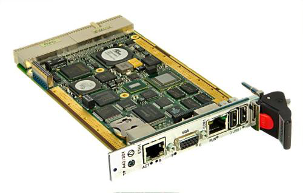

**（3）PC（Personal Computer，个人计算机）：**供单个用户使用的微机一般称为PC，是目前使用最多的一种微机。

**（4）便携式微机：**便携式微机大体包括笔记本计算机和个人数字助理( PDA）等。  


### **5.2  微机的主要性能指标**

**1. 主频**  即时钟频率，是指计算机CPU在单位时间内发出的脉冲数，它在很大程度上决定了计算机的运算速度，主频的单位是赫兹（Hz）。

```C

1. （2018年单项选择题）计算机的主频是指,
A.硬盘的读写速度 B.显示器的刷新速度
C.CPU的时钟频率 D.内存的读写速度

```

**2. 字长** 是指计算机的运算部件能同时处理的二进制数据的位数，它与计算机的功能和用途有很大的关系。

```字长
2019年真题
___________ 表示 CPU 每次处理数据的能力，常见的有 32 位 CPU、64位 CPU

```

**3. 内核数** CPU内核数指CPU内执行指令的运算器和控制器的数量所谓多核心处理器简单地说就是在一块CPU基板上集成两个或两个以上的处理器核心，并通过并行总线将各处理器核心连接起来。多核心处理技术的推出，大大地提高了CPU的多任务处理性能，并已成为市场的主流。 

**4. 内存容量**  是指内存储器中能存储信息的总字节数。一般来说，内存容量越大，计算机的处理速度越快。随着更高性能的操作系统的推出，计算机的内存容量会继续增加。

```C

1. （2008年单项选择题）在微机性能指标中，用户可用的内存容量是指.
A. ROM存储器 B. RAM和ROM存储器
C. RAM存储器 D. CD - ROM容量

```

**5. 运算速度**  单位时间内执行的计算机指令数。  

单位有MIPS（Million Instructions Per Second，每秒10 6条指令）和BIPS（Billion Instructions Per Second，每秒10 9条指令）。影响机器运算速度的因素很多，一般来说，主频越高，运算速度越快；字长越长，运算速度越快；内存容量越大，运算速度越快；存取周期越小，运算速度越快。

<span style="color:green;font-weight:bold;">☆☆☆MIPS BIPS </span>

**6.其他性能指标**  机器的兼容性（包括数据和文件的兼容、程序兼容、系统兼容和设备兼容），系统的可靠性（平均无故障工作时间MTBF），系统的可维护性（平均修复时间MTTR）等，另外，性能价格比也是一项综合性的评价计算机性能的指标。

**7.存储周期**   连续启动两次读或写操作所需间隔的最小时间，反映了主存的读取速度

<span style="color:green;font-weight:bold;">☆☆☆一般来说：主频越高，运算速度越快；字长越长，运算速度越快；内存越大，运算速度越快; 存储周期越小越快</span>

```AB

1. （2019年多项选择题）下列选项中，属于微机主要性能指标的有。
A.运算速度 B.内存容量 C.能配备的设备数 D.接口数

```


### **5.3 常见微型计算机的硬件设备**


#### **1 微处理器**

**微处理器**是将运算器、控制器和高速缓存集成在一起的超大规模集成电路芯片，是计算机中最重要的核心部件。 

目前微处理器的生产厂家有Intel公司、IBM公司、AMD公司和我国台湾的威盛公司等。Intel公司生产x86系列处理器，以及目前的主流产品酷睿系列、赛扬系列等；AMD公司目前的主流产品有羿龙、闪龙和速龙系列等，上述产品占据了85%以上的市场份额。图5所示就是Intel CPU和龙芯。

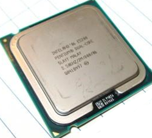

<span style="color:green;font-weight:bold;">☆☆☆微型计算机的 CPU 也叫微型处理器</span>


#### 2 存储器

**随机存储器：微机中的内存一般指指随机存储器(RAM)。**

**目前常用的内存有SDRAM和DDR SDRAM。**

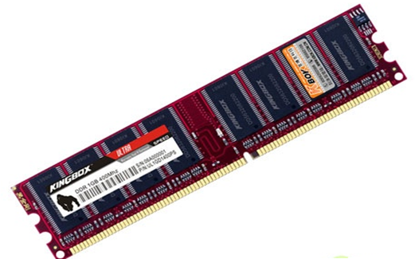

**外存储器**

**（1）软盘** 其直径为3.5英寸，容量为1.44 MB。软盘上有写保护口，当写保护口处于保护状态（即写保护口打开）时，只能读取盘中信息，而不能写入，用于防止擦除或重写数据，也能防止病毒侵入。

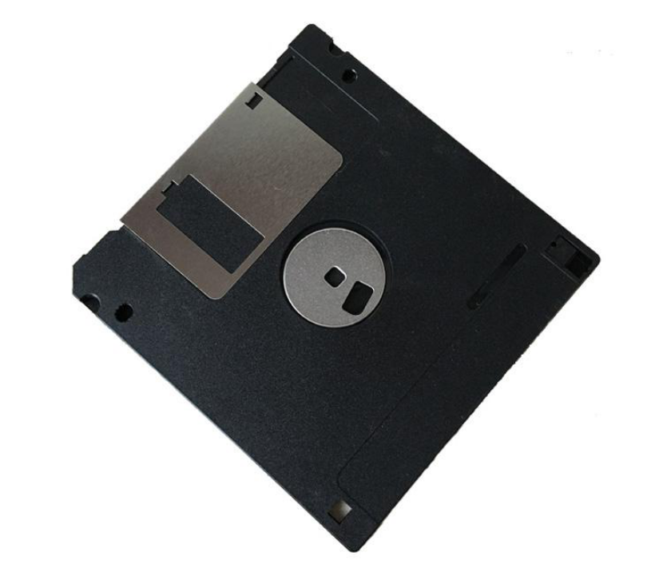

**（2）硬盘：**是微机上最重要的外存储器，它由多个质地较硬的涂有磁性材料的金属盘片组成，每个盘片的每一面都有一个读、写磁头，用于磁盘信息的读写。硬盘是目前存取速度最快的外存。

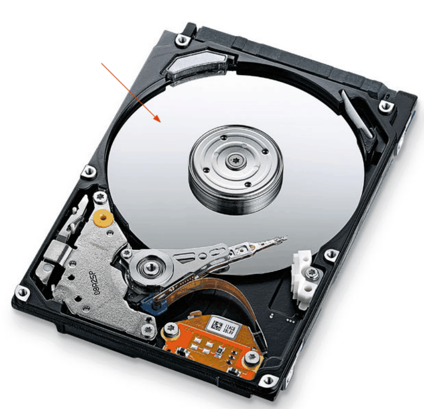

**（3）闪存（Flash Memory）**作为存储介质的半导体集成电路制成的电子盘已成为主流的可移动外存。电子盘又称“优盘”，可反复存取数据。

**（4）光存储器：**是利用激光技术存储信息的装置。目前用于计算机系统的光盘可分：为只读光盘（CD-ROM、DVD）、追记型光盘（CD-R、WORM）和可改写型光盘（CD-RW、MO）等。光盘存储介质具有价格低、保存时间长、存储量大等特点，已成为微机的标准配置。

<span style="color:green;font-weight:bold;">☆☆☆与 4.2 节 存储器描述的内容相似</span>


#### 3 微机常见总线标准

**总线（Bus）**是计算机各功能部件之间传送信息的公共通信干线，它是由导线组成的传输线束。微机内部信息的传送是通过<span style="color:red;font-weight:bold;">总线</span>进行的，各功能部件通过总线连在一起。微机中的总线一般分为<span style="color:red;font-weight:bold;">数据总线、地址总线和控制总线</span>，分别用来传输数据、数据地址及控制信号。常见的总线标准有：1）PCI总线；2）AGP总线；3）USB总线；4）IEEE 1394总线。

**1）PCI总线** 是由Intel、IBM、DEC公司推出的一种局部总线，它定义了32位数据总线，且可扩展为64位。PCI是迄今为止最成功的总线接口规范之一。PCI总线与CPU之间没有直接相连，而是经过桥接（Bridge）芯片组电路连接。该总线稳定性和匹配性出色，提升了CPU的工作效率，最大传输速率可达132MB/s

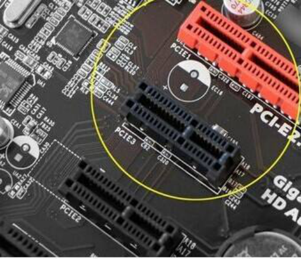

**2）AGP** 是加速图形端口的缩写，是为提高视频带宽而设计的总线结构，它是一种显示卡专用的局部总线，使图形加速硬件与CPU和系统存储器之间直接连接，无须经过繁忙的PCI总线，提高了系统实际数据传输速率和随机访问内存时的性能。目前AGP 8X的总线传输率达到2.1GB/s。 

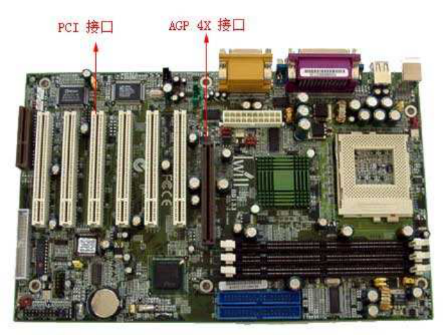

**3）USB总线** 即通用串行总线，是一种广泛采用的接口标准。它连接外设简单快捷，支持<span style="color:red;font-weight:bold;">热拔插</span>，成本低、速度快、连接设备数量多，广泛地应用于计算机、摄像机、数码相机和手机等各种数码设备上。目前USB Ver2.0数据传输率达到60Mbps。

**4）IEEE1394** 是一种串行接口标准，能非常方便地把电脑、电脑外设、家电等设备连接起来，能达到实时传送多媒体视频流的高速高带宽数据传输效果。IEEE 1394总线是目前最快的高速外部串行总线，1394a最高的传输速率达400Mbps，而1394b的最高传输速率达到了800Mbps，并且支持带电拔插。

<span style="color:green;font-weight:bold;">☆☆☆微机中的总线一般分为数据总线、地址总线和控制总线</span>

<span style="color:green;font-weight:bold;">☆☆☆PCI总线与CPU之间没有直接相连，而是经过桥接（Bridge）芯片组电路连接</span>

#### **4. 主板**

**主板**是微型计算机系统中<span style="color:red;font-weight:bold;">最大</span>的一块电路板，有时又称为母板或系统板，是一块带有各种插口的大型印刷电路板（PCB） 。它将主机的CPU芯片、存储器芯片、控制芯片、ROM BIOS芯片等结合在一起。

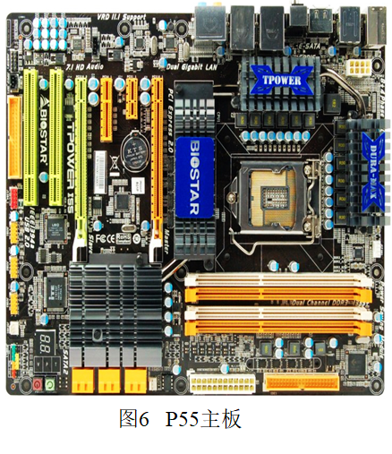


BIOS 和 CMOS 区别

所谓 BIOS，实际上就是微机的基本输入输出系统 Basic Input-Output System，是集成在微机主板上的一个 ROM 芯片上，你可以理解 BIOS 是程序和ROM硬件的统称。

CMOS  是可读写 RAM 芯片，主要用来保存时间、日期、硬盘参数，CMOS RAM 芯片由系统通过一块后备电池供电，无论是在关机状态中，还是遇到系统掉电的情况，CMOS 信息都不会丢失。

现在，很多厂家将 CMOS 设置程序做到了 BIOS 芯片中，在开机时通过按下某个特定的键就可以进入 CMOS 设置程序，可以非常方便地对系统进行设置，因此这种 CMOS 设置又通常被叫做 BIOS 设置。

```B

1. （2015年判断题）主板是微型计算机系统中最大的一块电路板，它需要插到插槽中才能工作。
A.正确 B.错误

```


#### **5. 输入设备**

**输入设备**是将原始信息转化为计算机能接受的二进制数，以便计算机能够处理的设备。 


#### **6. 输出设备**

**输出设备：**有显示器、打印机、绘图仪和音箱等。

1）<span style="color:red;font-weight:bold;text-decoration:underline">显示系统:包括显示器和显示适配器（又称显示卡）</span>

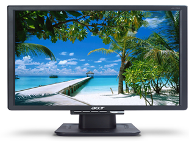

①显示器的种类有很多，按所采用的显示器件分类，阴极射线管、液晶、等离子显示器等，与传统的阴极射线管相比，液晶显示器具有无辐射、体积小、耗电量低、美观等优点，已经成为显示器的主流配置。

显示系统的主要性能指标有显示分辨率、颜色质量和刷新速度

分辨率是指单位面积显示像素的数量。如某显示器的水平方向可排列640个像素，垂直方 向可排列480个像素。这时，则称该种显示器的分辨率为640 x 480。

颜色质量是指在某一分辨率下，每一个像素点可以有多少种色彩来描述，它的单位是位 （bit）， 具体地说，8位所能表示的颜色数最多是256种（00000000、00000001、11100001…各表示一 种颜色，即256个不同二进制数），每一个像素点就可以取这256种颜色中的一种来描述。

 ② 显示卡又称显示适配器或显卡，它是插在微型机主机箱内扩展槽上的一块电路板，显卡 在显示驱动程序的控制下，负责接收CPU输出的显示数据，按照显示格式进行变换并存储在显存中，再把显存中的数据按照显示器要求的方式输出到显示器。

**2）打印机** 

点阵打印机又称针式打印机，是利用打印头内的点阵撞针撞击打印色带，在打印纸上产生打印效果。

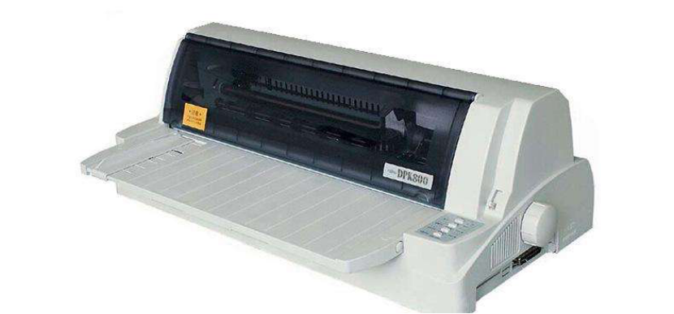

喷墨打印机的打印头由细小的喷墨口组成，当打印头横向移动时，喷墨口可以按一定的方式喷射出墨水，打到打印纸上，形成字符、图形等。

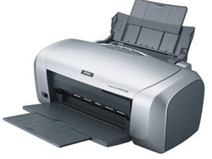

激光打印机是一种高速度、高精度、低噪声的非击打式打印机。它是激光扫描技术与电子照相技术相结合的产物，利用了激光的定向性、能量集中性。 

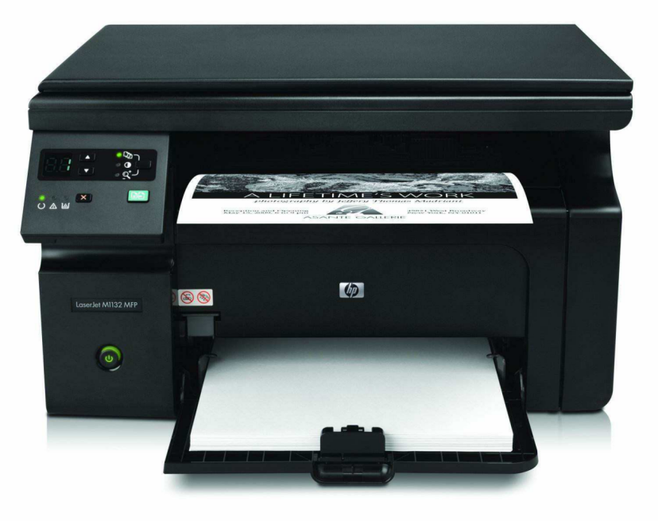


**3）声音系统**

 音频信号是连续的模拟信号，而电脑处理的只能是数字信号，因此，电脑要对音频信号进行处理，首先必须进行模/数（A/D）的转换。

<span style="color:green;font-weight:bold;">☆☆☆音频信号是模拟信号</span>

这个转换过程实际上就是对音频信号的采样和量化过程，即把时间上连续的模拟信号转变为时间上不连续的数字信号，只要在连续量上等间隔地取足够多的点，就能逼真地模拟出原来的连续量。这个“取点”的过程我们称为采样（Sampling），采样精度越高（“取点”越多）数字声音越逼真。

 采样频率是指每秒钟对音频信号的采样次数。单位时间内采样次数越多，即采样频率越高，数字信号就越接近原声。采样频率只要达到信号最高频率的两倍，就能精确描述被采样的信号。一般来说，人耳的听力范围在20Hz到20kHz之间，因此，只要采样频率达到40kHz，就可以满足人们的要求。现时大多数声卡的采样频率都已达到44.1kHz或48kHz，即达到所谓的CD音质水平了。

<span style="color:green;font-weight:bold;">☆☆☆采样的频率越高，越接近原声</span>


## 6 **新一代信息技术**

掌握云计算、大数据、物联网、人工智能、区块链等新一代信息技术的基本概念，了解新一代信息技术的应用及其发展趋势。

### 6.1 云计算

------

#### 1 基础概念

**云**实质上就是一个网络，狭义上讲，云计算就是一种提供资源的网络，使用者可以随时获取“云”上的资源，按需求量使用，并且可以看成是无限扩展的，只要按使用量付费就可以，“云”就像自来水厂一样，我们可以随时接水，并且不限量，按照自己家的用水量，付费给自来水厂就可以。

**云计算**（cloud computing）是分布式计算的一种，指的是通过网络“云”将巨大的数据计算处理程序分解成无数个小程序，然后，通过多部服务器组成的系统进行处理和分析这些小程序得到结果并返回给用户。

特点：虚拟化技术、动态可扩展、按需部署、灵活性高、可靠性高、性价比高。

服务类型： IaaS、PaaS、SaaS


#### 2 主要应用场景

云计算应用之一：金融云。金融云是利用云计算的模型构成原理，将金融产品、信息、服务分散到庞大分支机构所构成的云网络当中，提高金融机构迅速发现并解决问题的能力，提升整体工作效率，改善流程，降低运营成本。

云计算应用之二：制造云。制造云是云计算向制造业信息化领域延伸与发展后的落地与实现，用户通过网络和终端就能随时按需获取制造资源与能力服务，进而智慧地完成其制造全生命周期的各类活动。

云计算应用之三：教育云。教育云是“云计算技术”的迁移在教育领域中的应用，包括了教育信息化所必须的一切硬件计算资源，这些资源经虚拟化之后，向教育机构、从业人员和学习者提供一个良好的云服务平台。

云计算应用之四：医疗云。医疗云是指在医疗卫生领域采用云计算、物联网、大数据、4G通信、移动技术以及多媒体等新技术基础上，结合医疗技术，使用“云计算”的理念来构建医疗健康服务云平台。

云计算应用之五：云游戏。云游戏是以云计算为基础的游戏方式，在云游戏的运行模式下，所有游戏都在服务器端运行，并将渲染完毕后的游戏画面压缩后通过网络传送给用户。

云计算应用之六：云会议。云会议是基于云计算技术的一种高效、便捷、低成本的会议形式。使用者只需要通过互联网界面，进行简单易用的操作，便可快速高效地与全球各地团队及客户同步分享语音、数据文件及视频。

云计算应用之七：云社交。云社交(Cloud Social)是一种物联网、云计算和移动互联网交互应用的虚拟社交应用模式，以建立著名的“资源分享关系图谱”为目的，进而开展网络社交。

云计算应用之八：云存储。云存储是指通过集群应用、网格技术或分布式文件系统等功能，将网络中大量各种不同类型的存储设备通过应用软件集合起来协同工作，共同对外提供数据存储和业务访问功能的一个系统。

云计算应用之九：云安全。云安全(Cloud Security)通过网状的大量客户端对网络中软件行为的异常监测，获取互联网中木马、恶意程序的新信息，推送到Server端进行自动分析和处理，再把病毒和木马的解决方案分发到每一个客户端。

云计算应用之十：云交通。云交通是指在云计算之中整合现有资源，并能够针对未来的交通行业发展整合将来所需求的各种硬件、软件、数据


### 6.2 大数据

#### 1 基本概念

定义：大数据（bigdata），IT行业术语，巨量数据，具体是指 无法在一定时间范围内用常规软件工具进行捕捉、管理和处理的 数据集合，是需要新处理模式才能具有更强的决策力、洞察发现 力和流程优化能力的海量、高増长率和多样化的信息资产。 

特征：IBM提出5V特点，大容量（Volume）、髙速（Velocity） 、多样（Variety），真实性（Veracity）、低价值密度（value ），再有可变性（Variability）、复杂性（Complexity） 结构：大数据包括结构化、半结构化和非结构化数据，非结构化 数据越来越成为数据的主要部分。 

意义：有人把数据比喻为蕴藏能量的煤矿。马云曾提到，未来的 时代将不是IT时代，而是DT时代，DT就是Data Technology

#### 2 大数据的应用

洛杉矶警察局和加利福尼亚大学合作利用大数据预测犯罪的发生。

Google流感趋势(Google Flu Trends)利用搜索关键词预测禽流感的散步

统计学家内特•西尔弗(Nate Silver)利用大数据预测2012美国选 举结果。

麻省理工学院利用手机定位数据和交通数据建立城市规划。 

###  6.3 物联网

#### 1 基本概念

物联网(loT , Internet of things )即“万物相连的互联网，是互联网基础上的延伸和扩展的网络，将各种信息传感设备与 互联网结合起来而形成的一个巨大网络，实现在任何时间、任何 地点，人、机、物的互联互通 

定义：通过射频识别、红外感松器、全球定位系统、激光扫描器 等信息传感设备，按约定的协议，把任何物品与互联网相连接， 进行信息交换和通信，以实现对物品的智能化识别、定位、跟踪 、监控和管理的一种网络。

特征：整体感知、可靠传输和智能处理 

关键技术：射频识别技术、传感网、M2M系统框架(M2M是 Machine-to-Machine/Man的简称)、云计算

#### 2 物联网应用

物联网的应用领域涉及到方方面面，在工业、农业、环 境、交通、物流、安保等基础设施领域的应用。

能交通物联网技术在道路交通方面的应用比较成 速路口设置道路自动收费系统（简称 ETC） 

智能家居：如智能摄像头、窗户传感器、 烟雾探测器。 

公共安全：近年来全球气候异常情况频发，灾害的突 发性和危害性进一步加大，互联网可以实时监测环境 的不安全性情况，提前预防、实时预警、及时采取应 对措施，降低灾害对人类生命财产的威胁。例海洋污 染的防治、海底资源的探测

### 6.4 人工智能

#### 1 基本概念

定义：人工智能(Artificial Intelligence),英文缩 写为Al。它是班究、开发用于模拟、延佳和扩展人的智能的理论、方法、技术及应用系统的一门新的技术科学。 

#### 2 人工智能应用

机器视觉，指纹识别，人脸识别，视网膜 识别，虹膜识别，掌纹识别，专家系统，自动规划， 智能搜索，定理证明，博弈，自动程序设计，智能控 制，机器语言和图像理解，遗传编程等。 


### 6.5 区块链

#### 1. 区块链的概念

狭义上讲，区块链是一种按照时间顺序将数据区块以链条的方式组合成特定数据结构，并以密码学的方式保证其不可篡改、不可伪造的去中心化共享总账（Decentralized Shared Ledger），能够安全存储简单的、有先后关系、 能在系统内验证的数据。

> **简单的讲，区块链就是一个去中心化的分布式数据库，分布式环境中的每一个节点都不能保证可信。数据库中存储的是以时间先后顺序排列的数据区块，每一个区块中保存的是若干条交易记录，运用密码学的方法生成区块以保证其中数据不可篡改、不可伪造、可以验证；以共识算法使全网所有节点（理论上是所有节点）完成对区块的认可。**

广义上讲，区块链技术是利用加密链式区块结构来验证和存储数据、利用分布式节点共识算法来生成和更新数据、利用自动化脚本代码（智能合约）来编程和操作数据的一种全新的去中心化基础架构和分布式计算范式。

#### 2 区块链的特点

去中心化、不可篡改、不可伪造、可验证、匿名

#### 3 区块链的应用

区块链由于其结构特点有着广阔的应用前景。最早，区块链作为比特币的核心技术被提出来。随着区块链的发展，尤其是与智能合约的结合，区块链技术的应用早已不再仅仅局限于数字货币等金融领域。

区块链除了应用于金融领域外，还可以应用于能源互联网（能源区块链）、医疗事业（医疗区块链）、学术界学术记录、供应链管理、共享单车、云存储等。

